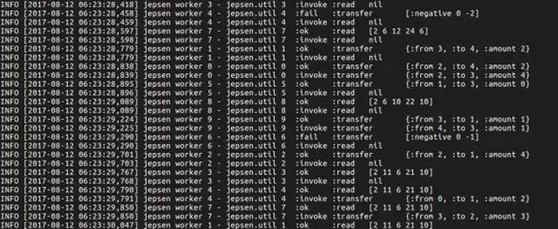
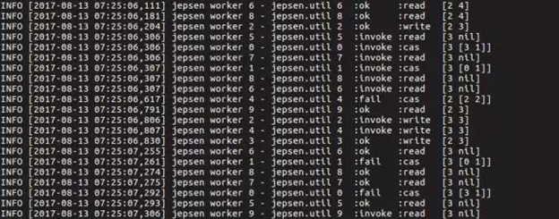

- [What is Jepsen?](#what-is-jepsen)
- [How does Jepsen work?](#how-does-jepsen-work)
  - [DB](#db)
  - [Client](#client)
  - [Checker](#checker)
  - [Nemesis](#nemesis)
  - [Generator](#generator)
- [Jepsen tests that TiDB goes through](#jepsen-tests-that-tidb-goes-through)
  - [The `Bank` Test](#the-bank-test)
  - [The `Set` Test](#the-set-test)
  - [The `Register` Test](#the-register-test)
- [Miscellaneous](#miscellaneous)

## What is Jepsen?

Written by [Kyle Kingsbury](https://aphyr.com/about) in Clojure. Jepsen is a test framework for distributed systems verification. Kingsbury has used it to verify the consistency of many famous distributed systems (etcd, ZooKeeper, CockroachDB, etc.) and found multiple bugs in some of these systems. The verification process and reflections on the consistency verification are presented in the [author's blog](https://aphyr.com/tags/jepsen).

## How does Jepsen work?

Jepsen consists of 6 nodes, one control node and five controlled nodes (by default they're named n1, n2, n3, n4, and n5). The control node sends all instructions from shell script to SQL statements, to some or all of the controlled nodes. Jepsen provides a few key APIs for distributed systems verification:

### DB

DB encapsulates the download, deployment, startup and shutdown commands of the target system. The core function consists of setup and teardown. When Jepsen is testing TiDB, setup is responsible for downloading binaries and starting PD (Placement Driver), TiKV and TiDB in turn while teardown shutdowns the entire TiDB cluster and deletes logs.

### Client

Client encapsulates the client that each test needs to provide and each client provides two interfaces: `setup` and `invoke`. `Setup` is responsible for connecting with TiDB and `invoke` includes SQL statements that the client calls to TiDB during the test and the statements are subject to test cases.

### Checker

Checker is used for verifying the history produced by the test, determining whether the test result is as expected. Below shows the format of the history:

### Nemesis

Nemesis introduces failures across the cluster, such as the common network partition, network latency, and node downtime. In TiDB testing, there are the following types of Nemesis:

+ `parts`: network partition
+ `majority-ring`: each node sees different majority of other nodes
+ `start-stop`: send SIGSTOP to some nodes
+ `start-kill`: send SIGKILL to some nodes

After introducing the `parts` type into the tests, a `time-out` error occurs when executing some statements as shown below:

### Generator

Generator, the event generator of Jepsen, interweaves the operations of Client with that of Nemesis and generates specific execute statements for the entire test process.

    <a href="/download" onclick="trackViews('When TiDB Meets Jepsen', 'download-tidb-btn-middle')"><button>Download TiDB</button></a>
    <a href="https://share.hsforms.com/1e2W03wLJQQKPd1d9rCbj_Q2npzm" onclick="trackViews('When TiDB Meets Jepsen', 'subscribe-blog-btn-middle')"><button>Subscribe to Blog</button></a>

## Jepsen tests that TiDB goes through

TiDB has gone through 3 Jepsen tests: `bank`, `set` and `register`.

### The `Bank` Test

The `Bank` Test is used for verifying snapshot isolation. This test simulates various transfers in a bank system and each initial bank system is as follows:

1 to 5 represents the account name respectively and 10 means the account balance. The test will randomly generate transfer information:

The above diagram means that the amount of 5 is transferred from Account 1 to Account 2. Meanwhile, the test randomly reads the deposit information of all accounts. For example, at some point, the deposit information of an account can be as below:

Below is a screenshot in a test:

In snapshot isolation, all transfers should ensure that the total amount of all accounts in each moment should be the same. TiDB passed the test even if all kinds of nemesis have been introduced.

### The `Set` Test

This test concurrently inserts many rows into a table from different nodes and performs a final read of all rows to verify their presence. At the same time, due to the introduction of Nemesis, it is normal that values that return time-out will or will not appear in this table.

Below is a screenshot in a test:

Once again, TiDB passed the test.

### The `Register` Test

It is easy to understand this test: create a table and insert a value. We will then regard this value as a register and concurrently execute the read, write and cas (compare and swap) operations to it from different nodes in the test.

Later, we use a series of action history produced by Jepsen (as shown above) for Linearizability verification. This algorithm is the core of Jepsen and the reason why Jepsen is well-known in the industry.

## Miscellaneous

Each time when there is an update in the TiDB code, we will internally trigger continuous integration (CI) to execute Jepsen and use Jepsen to guarantee the data consistency of TiDB. If you are interested in distributed test and consistency verification, please join us.

TiDB Jepsen: [https://github.com/pingcap/jepsen/tree/master/tidb](https://github.com/pingcap/jepsen/tree/master/tidb)
