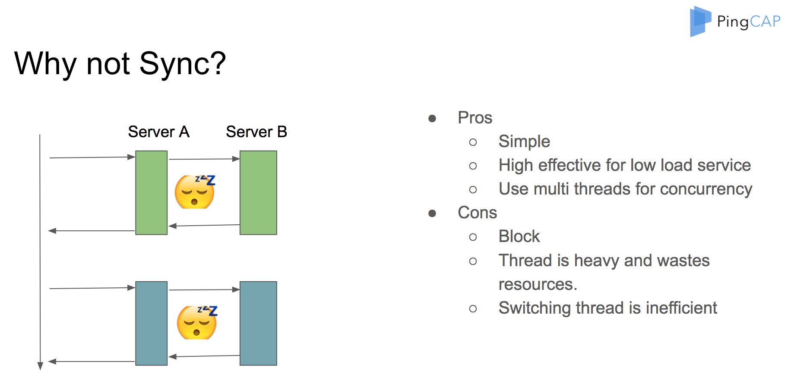
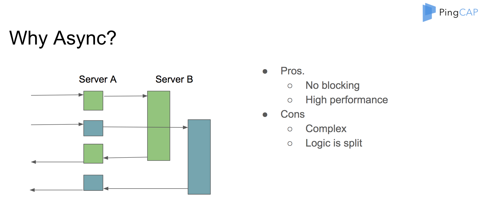
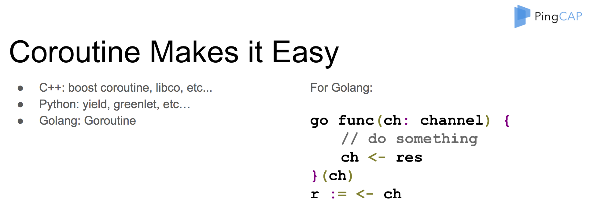
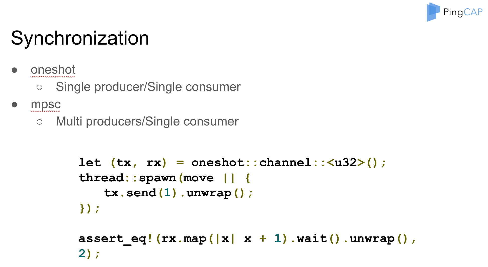
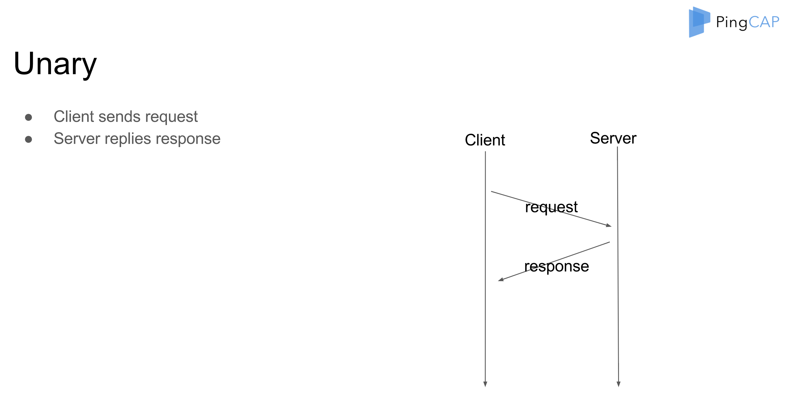
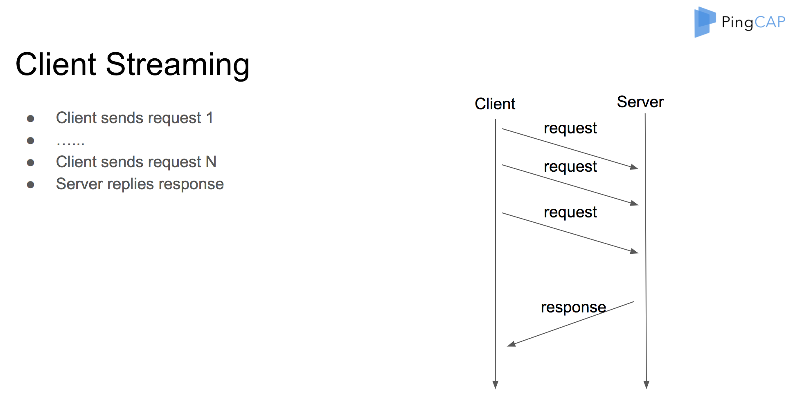
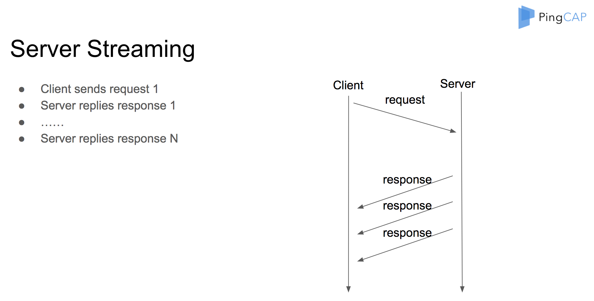
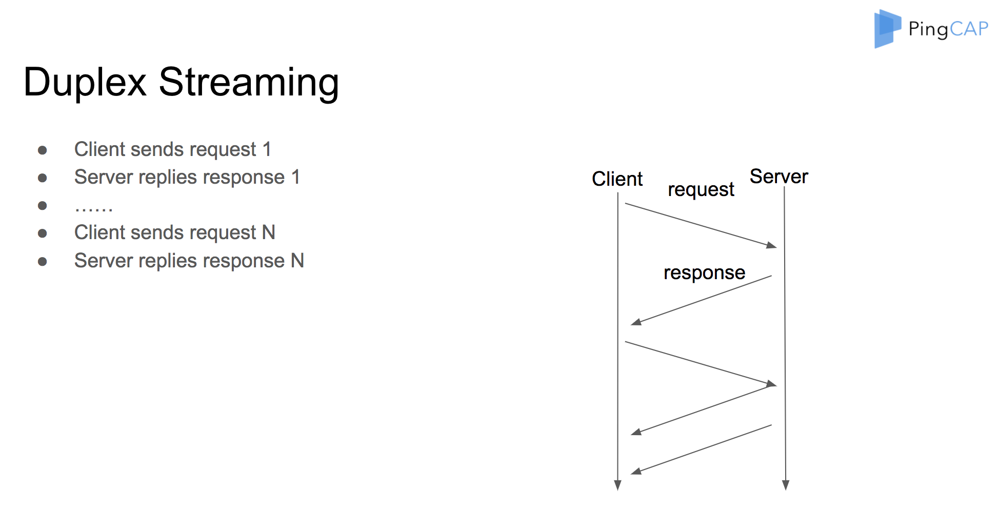
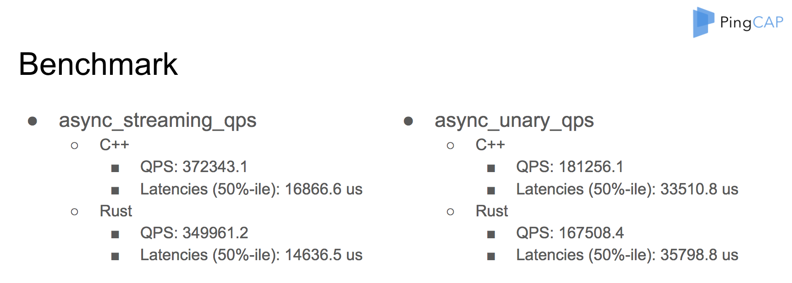

This is the speech Tang Liu (tl@pingcap.com) gave at the Bay Area Rust Meetup August 2017. [See the video](https://air.mozilla.org/bay-area-rust-meetup-august-2017/). 

<!-- TOC -->

- [Speaker Introduction](#speaker-introduction)
- [Async Programming](#async-programming)
    - [Why not Sync?](#why-not-sync)
    - [Why Async?](#why-async)
        - [Callback Hell](#callback-hell)
        - [Coroutine Makes it Easy](#coroutine-makes-it-easy)
        - [Future, Another Way](#future-another-way)
- [Futures in Rust](#futures-in-rust)
    - [Futures](#futures)
    - [Combinator](#combinator)
    - [Synchronization](#synchronization)
    - [Stream](#stream)
    - [Sink](#sink)
    - [Task](#task)
- [gRPC](#grpc)
    - [Why gRPC?](#why-grpc)
    - [HTTP/2](#http2)
    - [gRPC based on HTTP/2](#grpc-based-on-http2)
- [Combine Futures and gRPC](#combine-futures-and-grpc)
    - [C gRPC Keywords](#c-grpc-keywords)
    - [Pseudo Flow](#pseudo-flow)
    - [Unary](#unary)
    - [Client Streaming](#client-streaming)
    - [Server Streaming](#server-streaming)
    - [Duplex Streaming](#duplex-streaming)
- [Unary Future Implementation](#unary-future-implementation)
    - [Client Unary](#client-unary)
    - [Unary Future](#unary-future)
    - [Resolve Future](#resolve-future)
- [Benchmark](#benchmark)
- [Misc](#misc)

<!-- /TOC -->

## Speaker Introduction

Hi everyone! I am very glad to join the meetup here. Thanks, the Rust team.

Today I will talk about the Futures and gRPC in Rust. Before we start, let me introduce myself briefly. My name is Tang Liu, and siddontang on Github, chief engineer at PingCAP. I have been working on the next generation SQL database, [TiDB](https://github.com/pingcap/tidb), and a distributed key-value store, [TiKV](https://github.com/pingcap/tikv). By the way, TiKV is also written in Rust. I’m also an open source lover, and have some open source projects, such as LedisDB, go-mysql, go-mysql-elasticsearch, rust-prometheus, etc.

Today, I will first discuss Async briefly, then I will introduce Futures in Rust. Of course, you guys here are very familiar with them, so I will just go through it quickly. Then I will talk about gRPC, and in the end, I will show you how we use futures to wrap the gRPC in Rust.

## Async Programming

Let’s begin. About Async.

### Why not Sync?

The first thing is why not Sync. As we all know, the Sync programming is easier. If the load of your service is low, using Sync may be better. You just need to start some threads to handle the concurrence. 



But if we want to support a high performance service, such as a database, Sync is not enough. Sync I/O can block the execution, which reduces the performance. Although we can use threads, but thread is heavy and wastes system resources. What’s more, frequent thread switching is inefficient and causes the performance to reduce seriously.

### Why Async?

So we chose Async. 



There is no blocking in Async programming, so we don’t have to wait the slow I/O and can do other things. When the I/O is ready, the system can notify us and we can handle it again. This is very efficient and therefore, the performance is high. But as you can see, the Async way is much more complex and it is hard to write the code correctly. The code logic is split into pieces when the I/O is not ready and we have to switch to do other things. 

#### Callback Hell

```rust
auto r = make_shared<int>();
do_async_foo() {
	do_foo_a(|| {
	do_finish(|| {
		*r = 10;
    })
  })
})
```

Sometimes, we have to use the callback mechanism to handle the I/O or other asynchronous notifications, and may sink into the callback hell, like this. Oh, so many callbacks.

#### Coroutine Makes it Easy



Of course, if we have to write code like this, it might drive us crazy. Luckily, we have at least two ways to bypass it. First, it is the coroutine. 

Coroutine is a lightweight thread which is supported in many languages. Like the boost coroutine library, WebChat libco library in C plus plus, yield and greenlet in Python, and of course, goroutine in Go. 

Here is a simple example to use goroutine and channel in Go. The two internal cool features allow us to write high performance concurrent code easily. I personally believe that it is the main reason that Go becomes more and more popular nowadays.

#### Future, Another Way

```rust
let future = do_async( future() )
	.then( future_a() )
	.then( future_b() )
	.then( future_c() );
future.wait();
```

Some languages don’t provide coroutine, but we can have another workaround, which is future. Future is a kind-of promise. When we begin to resolve a future, the result of the future may not be ready now and cannot be retrieved now, but after the future is performed later, we can get the result again.

You can wait the future to be finished, and multiple futures can be combined into a future chain.

## Futures in Rust

So what about futures in Rust?  

In Rust, future has already been supported by [Alex](https://github.com/alexcrichton). Thanks, Alex!  

Based on the Rust trait, the future is zero cost, which means that you don’t need to do extra heap allocation or dynamic dispatch. Future is easy to use, you can combine many futures into a chain, and use the combinator like an Iterator API.   

The future is demand-driven, not callback, you should poll the future explicitly to check whether the future is ready or not. No callback can also avoid the heap allocation, and we can cancel the future easily too. 

### Futures

Future is a trait and the main function is poll.

```rust
pub trait Future {
	type Item;
	type Error;
	// check the future is resolved, return Ready or NotReady
	fn poll(&mut self) -> Poll<Self::Item, Self::Error>;
	// wait until the future is resolved
	fn wait() -> result::Result<Self::Item, Self::Error>;
}

pub type Poll<T, E> = Result<Async<T>, E>;
pub enum Async<T> {
    Ready(T),
    NotReady,
}
```

We must implement the poll for our customized future. The poll can return `NotReady`, which means the future is not ready and we should poll later. If `Ready` is returned, the future is finished and we can get the result. We can also wait the future to finish explicitly. If we call wait, the execution will be blocked until the future is performed.

**Future Example**

Here are some very simple future examples. For the `ok` future, `wait` will return `Ready`, the result is `1`; for the `empty` future, `poll` will return `NotReady`.

```rust
let f = ok::<u32, u32>(1);
assert_eq!(f.wait().unwrap(), 1);

let mut f = empty::<u32, u32>();
assert_eq!(f.poll(), Ok(Async::NotReady));
```
### Combinator

We can use combinator to chain the futures. 

```rust
let f = ok::<u32, u32>(1).map(|x| x + 1);
assert_eq!(f.wait().unwrap(), 2);

let f1 = ok::<u32, u32>(1);
let f2 = ok::<u32, u32>(2);
let (_, next) = f1.select(f2).wait().ok().unwrap();
assert_eq!(next.wait().unwrap(), 2);
```

For example, we can use the `ok` future plus map combinator, and the end result is `2`. We can use `select` to wait for two futures. If either future is ready, the `select` future is finished and returns the result plus a next future to be resolved later. 

### Synchronization

The future library provides two synchronization channels. One-shot is for SPSC and channel is for MPSC. Both can be used for communication cross threads. 



### Stream

Stream is like Future, and you can resolve the value one by one until the stream is finished. 

```rust
pub trait Stream {
	type Item;
	type Error;
	// check the future is resolved, return Ready or NotReady
	// Ready(Some) means next value is on the stream
	// Ready(None) means the stream is finished
	fn poll(&mut self) -> Poll<Option<Self::Item>, Self::Error>;
}
```

If the poll of the stream returns `Ready Some`, it means you can still get the next value of the stream. If `Ready None` is returned, it means the stream is finished and you can never poll the stream again.

### Sink

Sink is a way to send value asynchronously.

```rust
pub trait Sink {
	type SinkItem;
	type SinkError;
	fn start_send(self, item: Self::SinkItem) -> StartSend<Self::SinkItem, Self::SinkError>;
	fn poll_complete(&mut self) -> Poll<(), Self::SinkError>;
	fn close(&mut self) -> Poll<(), Self::SinkError>;
}
```

We can use `start_send` to send one value, and use `poll_complete` to flush the sink and check whether all values are sent or not, or you can use `close` to close the sink.

### Task

The task is used to drive the future computation. 

```rust
# If the future is not ready?
let handle = task::current();

# If the event of interest occurs?
handle.notify();

# What to do after notify?
executor.poll(f);

```

If the future is not ready, we can use task `current` to get a task handle. We can use task `notify` to wake up the task when it is ready, and the `executor` should poll the future again.

That’s all about the Rust futures for today.

## gRPC

Now let’s talk about gRPC. 

If you want to develop a service, the first thing you need to decide is how the client communicates with your service. You may implement your own protocol and RPC. Although it is efficient, it is not common. You may also use RESTful API based on HTTP protocol directly, but if you care about high performance and need to provide many APIs, it is not convenient.

### Why gRPC?

Now, many users choose gRPC, a widely used RPC framework developed by Google. The gRPC is supported by many languages. Users can communicate with your service with their favorite languages easily. The gRPC uses protocol buffer for serializing and de-serializing the binary data efficiently. The gRPC has rich interfaces, and you can use unary, client streaming, server streaming and duplex streaming for your own case. The gRPC is based on HTTP/2, so you can get many benefits. For example, you can use SSL of HTTP/2 for data encryption. 

### HTTP/2

The gRPC is based on HTTP/2. Unlike HTTP/1, which uses a text protocol, HTTP/2 is a binary protocol for performance, but it is hard for us to read directly. Luckily, many tools like wireshark have already supported parsing the protocol.

In HTTP/1, if we send a request, we must wait for the response and then send the next request again on the same connection. This is not efficient. But HTTP/2 uses stream to support multiplexing in one connection. 

HTTP/2 also supports priority, so we can serve the important request first. HTTP/2 supports control flow. We can control how and when to send data if possible. HTTP/2 uses HPACK to compress the HTTP header, to reduce the network transferred size. 

### gRPC based on HTTP/2

The gRPC uses HTTP/2 headers to pass the own headers of gRPC. It uses the HTTP/2 data frame to transfer data and maps the service name and method in the HTTP/2 path. Of course, the HTTP/2 content length is application gRPC plus proto.

That’s a brief introduction of gRPC. Let’s go on. 

## Combine Futures and gRPC

There are many gRPC implementations in different languages. Unfortunately, no one is available for Rust in production. But we really want to use gRPC in TiKV, so we decide to implement it by ourselves. 

### C gRPC Keywords

The Google gRCP has a core library written in the C language, and other supported languages like C plus plus, php, C sharp all use the C core API, so we decide to use it in Rust directly.

When we start, we should know some keywords of the C core. 

- Call. Call means a gRPC call, like unary, client streaming, server streaming and duplex streaming.
- Channel. Channel means a connection. 
- Server. We can register the service in the server. 
- Completion queue. It's the most important one. We drive the completion queue with the Next function infinitely.

### Pseudo Flow

Here is a pseudo flow for client unary when we use C API.

- Create completion queue
- Create client channel
- Create a call from the channel
- Start operations in batch of the call with a **tag**
- **Poll** completion queue to perform the call and return the event contains a **tag**
- Use tag to do something...

First, we create the completion queue, then create a channel with the client and server. Then we create a call from the channel, and start a batch of operations of the call with an associated tag. We poll the completion queue and get the event if the call is finished. Then we get the associated tag from the event and do something.

As you can see, the flow is asynchronous, so we can use future to wrap gRPC C API and support an ergonomic API for outside use.

### Unary

For unary, client sends a request, and waits for a response.



Client:

```rust
let future = unary(service, method, request);
let response = future.wait();
```

So in the client side, the API definition is simple. We can return a future directly to get the response later. 

Server Handler:

```rust
fn on_unary(context, request, response_sink) {
	context.spawn(|| {
		// do something with request
		response_sink.send(response)
	});
}
```

In the server side, the associated server handle looks like this, the context can spawn a task, and in the task, we can handle the request and use a sink to send the response back.

### Client Streaming

For client streaming, client sends many requests and receives a single response, then the client streaming is finished.



Client:

```rust
let (sink, future) = client_streaming(service, method);
sink = sink.send(request).wait().unwrap();
sink = sink.send(request).wait().unwrap();
……
let response = future.wait();
```

So for the client side, we return a sink plus a future, and use sink to send a request, and use future to wait for the response.

Server Handler:

```rust
fn on_client_streaming(context, request_stream, response_sink) {
	context.spawn(||{
	request_stream.fold(|request| {
	// do something
}.and_then() {
	response_sink.send();
}})}
```

In the server side, we use a stream to receive the client requests and use a sink to send the response back.

### Server Streaming

For server streaming, client first sends a request and then receives many responses one by one.



Client :

```rust
let stream = server_streaming(service, method, request);
stream.for_each(|response| {
	// do something
});
```

Server Handler:

```rust
Server Handler:
fn on_server_streaming(context, request, response_sink) {
	context.spawn(||{
		response_sink.send();
	});
}
```

So for the client side, we return a stream to recv the response. And for the server side, we use a sink to send the response back.

### Duplex Streaming

For duplex streaming, both the client and server can send many requests and responses.



Client:

```rust
let (sink, stream) = duplex_streaming(service, method);
sink.send_all();
stream.for_each();
```

Server Handler:

```rust
fn on_duplex_streaming(context, request_stream, response_sink) {
	context.spawn(||{
	let resps = request_stream.map().collect().flatten();
		response_sink.send_all(resps);
}
}
```

So for the client side, we return a sink plus stream. And for the server side, we also use a stream and a sink.

## Unary Future Implementation

Using future, sink and stream can wrap the C gRPC core API easily. Let’s dive in deep. I will use the client unary as an example, to see how we combine the future and gRPC. 

### Client Unary

First, we create a Call from the channel, and create a future and a tag. Because we must pass the tag to C API, here we use `Box::into_raw` to release its lifetime. Then we call the C start batch API.

```rust
let call = channel.create_call();
let (future, tag) = CallTag::batch_pair();
// create a tag and let gRPC manages its lifetime 
let tag_box = Box:new(tag);
let tag_ptr = Box::into_raw(tag_box) as _;
call_start_batch(…, tag_ptr);
```


### Unary Future

The future implementation is easy. In the poll function, we first check whether we have a result. If yes, we will return `Ready`; if not, we will check whether we have a task. If we have no task, or the task `will_notify_current` is false, we will use the task current to save the handle.

```rust
fn poll(&mut self) -> Poll<T, Error> {
	let guard = self.inner.lock();
	if let Some(res) = guard.result.take() {
		let r = try!(res);
		return Ok(Async::Ready(r));
}
// Has not been finished yet, Add notification hook
if guard.task.is_none() || !guard.task.as_ref().unwrap().will_notify_current() {
	guard.task = task::current();
}
Ok(Async::NotReady)
}
```

### Resolve Future

In the completion queue, we use `next` to get the next finished event, and use `Box` from raw to acquire the tag again. Then we resolve the tag, and set the result for the call. If there is a task handle, we will notify it.

In Completion Queue:

```rust
let e = cq.next();
// Get the tag from gRPC again
let tag: Box<CallTag> = unsafe { Box::from_raw(e.tag as _) } ;
tag.resolve(&cq, e.success != 0);
```

In Resolve:

```rust
let task = {
let mut guard = self.inner.lock();
guard.set_result(res) 
gurad.task.take();
};
task.map(|t| t.notify());
```

The flow is very easy, and client streaming, server streaming and duplex streaming also have the similar way, so I will not cover them now.

## Benchmark



Using future to support gRPC is very efficient. We have done many benchmarks. You can see that the performance is great. 

## Misc

Now we have already used gRPC in TiKV in production for a long time. It works well. If you want to try it, please check github.com/pingcap/grpc-rs. You can also use cargo to install grpcio.

That's all. Thank you very much.
