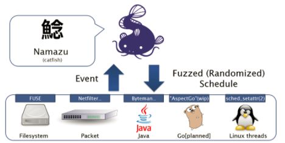
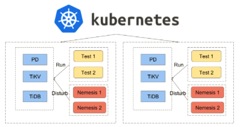
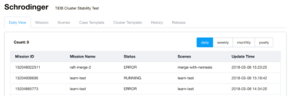
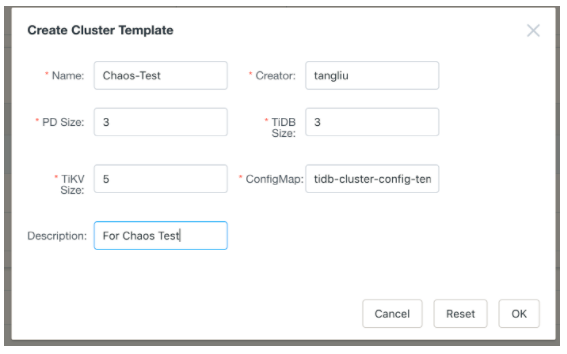
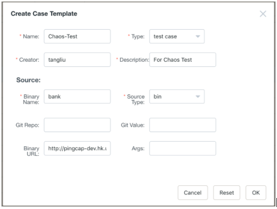
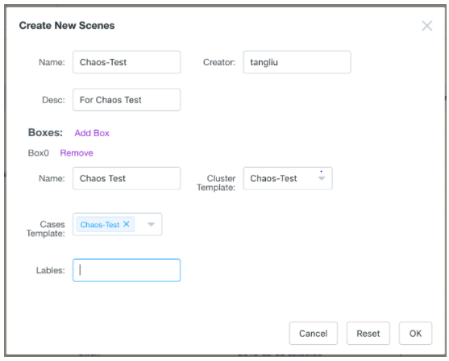
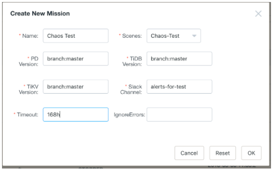

## What is Chaos?

In the world of distributed computing, you can never predict what will happen to your cluster. Anything is possible. A butterfly fluttering in Rio de Janeiro could change the weather in Chicago, or destroy an entire data center in Cairo. Network Time Protocol (NTP) might be out of sync, CPUs might mysteriously max out, or worse yet, your diligent DBA might accidentally remove data in the middle of the night.

As an open source distributed [NewSQL](https://en.wikipedia.org/wiki/NewSQL) Hybrid Transactional/Analytical Processing (HTAP) database, [TiDB](http://bit.ly/tidb_repo_publication) contains the most important asset of our customers--their data. One of the fundamental and foremost requirements of our system is to be fault-tolerant. But how do you ensure fault tolerance in a distributed database? In this article, I will cover the top fault injection tools and techniques in Chaos Engineering, as well as how we execute Chaos practices in TiDB.

## Why Do We Need Chaos

Ever since Netflix invented [Chaos Monkey](https://en.wikipedia.org/wiki/Chaos_Monkey) in 2011, this Monkey has become more and more popular. If you want to build a distributed system, letting the Chaos Monkey go a little crazy on your cluster can help build a more fault-tolerant, resilient, and reliable system.

Typically, we write as many unit tests as we can to ensure all of our logics are covered, build sufficient integration tests to guarantee that our system can work well with other components, and do performance tests to improve the handling of millions of requests.

Unfortunately, that's not enough for a distributed system. No matter how many unit, integration, or performance tests we do, we still can't guarantee that our system can withstand the unpredictability of in-production environment. We may meet disk failures, machine power lost, network isolation, and that's just the tip of the iceberg. To make distributed systems like TiDB more robust, we need a method to simulate unpredictable failures and test our responses to these failures. That's why we need Chaos Monkey.

## How to get "Chaotic"

Not only did Netflix invent Chaos, it also introduced the concept of "Chaos Engineering," which is a methodical way to uncover system-level weaknesses. There are some core [principles](http://principlesofchaos.org/) of the Chaos Engineering, as well as a whole book on [Chaos Engineering](http://www.oreilly.com/webops-perf/free/chaos-engineering.csp).

In TiDB, we apply Chaos Engineering to observe the state of our system, make hypothesis, conduct experiments, and verify those hypothesis with real results. We adhere to the principles, but also add our own flavors. Here's our 5-step Chaos methodology:

1. Use [Prometheus](https://prometheus.io/) as the monitoring tool to observe the status and behaviors of a TiDB cluster and collect the metrics of a stable cluster to establish a proxy for what a stable system looks like;

2. Make a list of hypothesis of certain failure scenarios and what we expect to happen. One example in TiDB's case: If we isolate one [TiKV](http://bit.ly/tikv_repo_publication) (the distributed key-value storage layer of TiDB) node from the cluster, the QPS (Queries Per Second) should drop, but will soon recover to another stable state.

3. Pick a hypothesis from our list;

4. Conduct an experiment on the chosen hypothesis by injecting faults and analyzing the result. If the result is different from our hypothesis, there may (or must) be something wrong or missing;

5. Rinse and repeat on another hypothesis from our list and automate the process.

One of the advanced principles in Chaos Engineering is to run experiments in a production environment. Before deploying TiDB for our users, we have to ensure it's battle-tested. However, we can't perform these experiments in our customers' production environment, because they entrust TiDB with their most mission-critical data. What we *can* do is create our own "battlefield,"--an internal production environment.

Currently, we are using TiDB to power [Jira](https://www.atlassian.com/software/jira) for our internal issues tracking and project management work, "eating our own dog food," so to speak. With this setup, we can run Chaos experiments on Jira. Without any warning, we would inject faults to jeopardize all aspects of the Jira system while our own employees are using it for their daily tasks, in order to simulate a series of cascading “accidents” to identify possible system loopholes. We call this practice “military drill,” and it occurs frequently during our daily operations. In the following sections, I will walk through how we do fault injection and automate the process.

## How TiDB does Fault Injection

[Fault injection](https://en.wikipedia.org/wiki/Fault_injection) is a technique for improving the coverage of a test by introducing faults to test code paths, in particular error handling code paths. It is widely considered as an important part of developing robust software. There are many ways to do fault injection to assess the system. In TiDB, faults are injected in the following ways:

1. Use `kill -9` to kill the process by force or use `kill` to kill the process gracefully and then restart it.

2. Send SIGSTOP to hang or SIGCONT to resume the process.

3. Use `renice` to adjust the process priority or use `setpriority` for the threads of the process.

4. Max out the CPU.

5. Use `iptables` or `tc` to drop or reject the network packages or delay the network packages.

6. Use `tc` to reorder the network packages and use a proxy to reorder the gRPC requests.

7. Use `iperf` to take all network throughput.

8. Use `libfuse` to mount a file system and do the I/O fault injection.

9. Link `libfiu` to do the I/O fault injection.

10. Use `rm -rf` forcbily to remove all data.

11. Use `echo 0 > file` to damage a file.

12. Copy a huge file to create the `NoSpace` problem.

## Top Fault Injection Tools

### Kernel Fault Injection

A popular fault injection tool is the Fault Injection Framework that's included in the Linux kernel, which developers can use to implement simple fault injection to test device drivers. For more accurate fault injections, e.g. returning error when a user reads a file, or allocating failure in `malloc`, we use the following fault injection process:

1. Rebuild the kernel with the framework enabled

2. Use the kernel fault injection as follow:

 echo 1 > /sys/block/vdb/vdb1/make-it-fail

 mount debugfs /debug -t debugfs

 cd /debug/fail_make_request

 echo 10 > interval # interval

 echo 100 > probability # 100% probability

 echo -1 > times # how many times: -1 means no limit

3. When we access the file, we may get following errors:

 > Buffer I/O error on device vdb1, logical block 32538624
 > lost page write due to I/O error on vdb1

4. We can inject fault to the allocation as follow:

 echo 1 > cache-filter

 echo 1 > /sys/kernel/slab/ext4_inode_cache/failslab

 echo N > ignore-gfp-wait

 echo -1 > times

 echo 100 > probability

 > cp linux-3.10.1.tar.xz linux-3.10.1.tar.xz.6
 > cp: cannot create regular file 'linux-3.10.1.tar.xz.6': Cannot allocate memory

Although the Linux kernel's Fault Injection Framework is powerful, we have to rebuild the kernel because some users won't enable it in their production environment.

### SystemTap

Another way to inject fault is ['SystemTap'](https://sourceware.org/systemtap/), a scripting language and tool which can assist diagnosis of a performance or functional problem. We use `SystemTap` to probe the kernel function and do accurate fault injection. For example, we can delay the I/O operation in the read/write return by doing the following:

 probe vfs.read.return {

  if (target() != pid()) next

  udelay(300)

 }

 probe vfs.write.return {

  if (target() != pid()) next

  udelay(300)

 }

We can also change the I/O return value. Below we inject an `EINTR` for read and `ENOSPC` for write:

 probe vfs.read.return {

  if (target() != pid()) next

  // Interrupted by a signal

  $return = -4

 }

 probe vfs.write.return {

  if (target() != pid()) next

  // No space

  $return = -28

 }

### Fail

Sometimes, we want to do **fault injection in specific places** like:

 fn save_snapshot() {

  save_data();
  save_meta();
 }

We do this because, for example, we want to see the system panic after the snapshot data is saved, but meta is not yet. How can we do this? We can use a mechanism called [`fail`](https://www.freebsd.org/cgi/man.cgi?query=fail&sektion=9&apropos=0&manpath=FreeBSD%2B10.0-RELEASE). Using `fail` we can inject the fault exactly where we want it. In Go, we can use [`gofail`](https://github.com/coreos/gofail) and in Rust, we can use [`fail-rs`](https://github.com/pingcap/fail-rs).

For the above example, now we can do:

 fn save_snapshot() {

  save_data();

  fail_point!("snapshot");
  save_meta();
 }

In this example, we inject a fail point with name "snapshot," and then we can trigger it to throw a panic message like `FAILPOINTS=snapshot=panic(msg) cargo run`.

    <a href="/download" onclick="trackViews('From Chaos to Order -- Tools and Techniques for Testing TiDB, A Distributed NewSQL Database', 'download-tidb-btn-middle')"><button>Download TiDB</button></a>
    <a href="https://share.hsforms.com/1e2W03wLJQQKPd1d9rCbj_Q2npzm" onclick="trackViews('From Chaos to Order -- Tools and Techniques for Testing TiDB, A Distributed NewSQL Database', 'subscribe-blog-btn-middle')"><button>Subscribe to Blog</button></a>

## Fault Injection Platforms

We have introduced some individual methods for fault injection. There are also platforms that are integrated with these methods, which enable us to inject faults separately or simultaneously. The most popular of these platforms is [Namazu](https://github.com/osrg/namazu), a programmable fuzzy scheduler to test a distributed system.

 Fault Injection Platform Namazu 

You can run your system in the Namazu container. In the container, Namazu will schedule the process through `sched_setattr`, the file system with fuse and the network with netfilter. Unfortunately, we found that enabling file system scheduler of Namazu will cause the CentOS 7 operating system to crash, so for TiDB, we only run Namazu on Ubuntu.

Another platform is [Jepsen](https://github.com/jepsen-io/jepsen) which is designed to verify the linearizability of the distributed database. Jepsen uses Nemeses to disturb the system, records the client operations, and verifies the linearizability through the operation history.

We have set up a Clojure library to test TiDB, and you can read the details here: [TiDB Jepsen Test](https://github.com/pingcap/jepsen/tree/master/tidb). Jepsen has been integrated in the continuous integration (CI) tool, so that every update in the TiDB code base will automatically trigger CI to execute the Jepsen test. You can check out the details in an earlier blog post: [When TiDB Meets Jepsen](https://pingcap.com/blog/2017-09-01-tidbmeetsjepsen/).

## Automatic Chaos: Schrodinger

The tools or platforms we've mentioned so far are all publicly available tools to help you put Chaos into your system. But for testing TiDB, we needed to automate all these tests to improve both efficiency and coverage. That's what drove us to create Schrodinger.

In 2015, when we first began to develop TiDB, everytime we committed a feature, we would do the following:

1. Build the TiDB binary;

2. Ask the administrator to allot some machines for testing;

3. Deploy the TiDB binaries and run them;

4. Run the test cases;

5. Run the Nemeses to inject fault;

6. Clean up everything and release the machines after all tests are finished.

As you can see, all these tasks involved manual and tedious operations. When the TiDB code base grew, many tests needed to run concurrently. The manual way simply couldn't scale.

To solve this problem, we built Schrodinger, a test platform that performs Chaos Engineering automatically. All we needed to do was configure Schrodinger to perform the specific testing tasks, and it would take it from there.

Schrodinger is based on Kubernetes (K8s), so we don't depend on physical machines anymore. K8s will hide the machine-level details and help us schedule the right job to the right machines.

 Shrodinger Architecture on K8s 

Below is the homepage screenshot of Schrodinger, showing an overview of tests that are running. We can see that two tests failed and one test is still running. If the test fails, an alert will be sent to our Slack channel and notify a developer to fix the problem.

 Schrodinger Homepage 

### How to use Schrodinger?

Schrodinger can be implemented in 5 steps:

1. Create a TiDB cluster using the **Create Cluster Template**. In the following snapshot, we deploy a TiDB cluster with 3 Placement Driver (PD) servers, 5 TiKV servers, and 3 TiDB servers. (PD is the managing component of a TiDB cluster, responsible for meta-data store, schedule and load-balancing, and allocating transaction IDs.)

 Create a TiDB Cluster 

2. Create a test case for the cluster using the **Create Case Template**. We can use a prebuilt binary test like the following `bank` test, or let Schrodinger build a new one from the Git source.

 Create a TiDB test case 

3. Create a scene to link the cluster we configured in the previous step and add the test cases to this cluster.

 Create a testing scene 

4. Create a mission to tell Schrodinger the detailed versions of the TiDB cluster and attach a Slack channel for alert. For example, in the following snapshot, we let Schrodinger build the entire cluster from the newest master sources.

 Create a testing mission 

5. After we create the mission, Schrodinger gets working and runs all the test cases automatically.

 Shrondinger automation 

Schrodinger can now run tests in 7 different clusters simultaneously, 24/7 without stop. This frees up our team from manual testing; we just need to configure the testing environments and tasks.

For future development, we will continue optimizing the process to make our Chaos Monkey smarter. Instead of always manually setting up testing environments and tasks, we are working on ways to make Schrodinger "study" the cluster and figure out how to inject fault automatically. Netflix has already been doing research in this area and published a related paper: [Automating Failure Testing Research at Internet Scale](https://people.ucsc.edu/~palvaro/socc16.pdf). We are building off this research to advance our own R&D effort, and will share our progress soon!  

## TLA+ in TiDB

Besides the fault injection and Chaos Engineering practices, we are also using [TLA+](https://github.com/tlaplus), a formal specification language developed to design, model, document, and verify concurrent systems to verify our distributed transaction implementation and related algorithms. TLA+ is developed by [Leslie Lampor](https://en.wikipedia.org/wiki/Leslie_Lamport), and we have already used it to prove our Two-Phase transaction algorithm, documented [here](https://github.com/pingcap/tla-plus). We plan to use TLA+ to prove more algorithms in the future.

## Final Thoughts

From the moment we started to build TiDB, we decided to use Chaos to test it. As I've shown, Chaos is a great way to detect systematic uncertainty in a distributed system and build confidence in the system's resiliency. We firmly believe that a proper and thoughtful application of Chaos Engineering will determine the success of a distributed system.

If you are interested in Chaos Engineering, please don't hesitate to contact me at [**tl@pingcap.com**](mailto:tl@pingcap.com).

Originally published at [**The New Stack**](https://thenewstack.io/chaos-tools-and-techniques-for-testing-the-tidb-distributed-newsql-database/).
