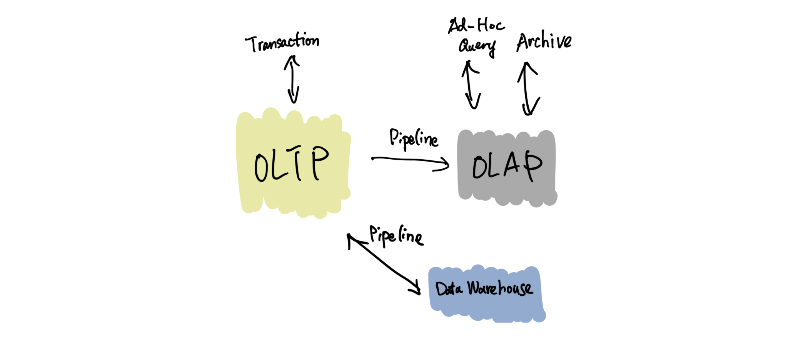
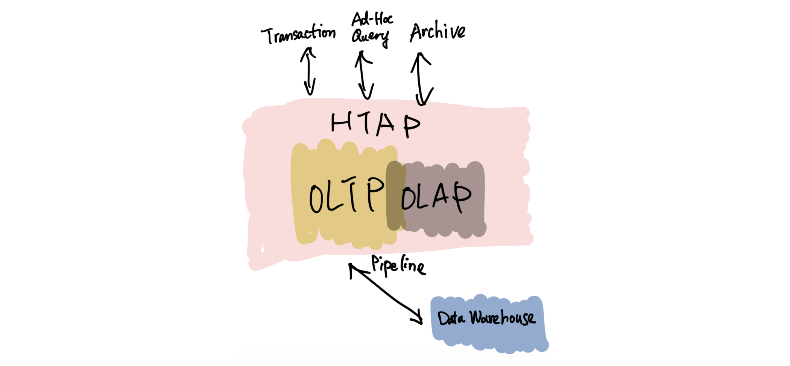

Today is [PingCAP](https://pingcap.com/)'s 5-year birthday. The 5th anniversary seems to be the perfect time to look back and look forward.

I still remember that afternoon five years ago when Max, Dylan and I were picturing what the future of the database might be like. We planted a seed back then by starting up PingCAP to build the database we would want for ourselves, in the open-source way. Now the seed has grown from our inception to the database platform serving almost 1,000 production adopters and millions of people every day around the globe, thanks to hundreds of contributors all over the world.

As the database technology continues to evolve, I would like to open a discussion about what I think the future holds for databases.

**TL;DR:**

The future of the database is about unification, adaptiveness, and intelligence. I believe when we face the uncertainties and the unpredictables in the future, we will have the **unified** infrastructure to **adapt intelligently**.

When we first started, it was simple and straightforward: we want to build a better database. There was nothing fancy or magic about the technology, the algorithm or even the shared-nothing architecture we chose. What fascinated me is the possibility of building the infrastructure that could serve as the single source of truth so the applications and the businesses on top of it can adapt to the uncertainties.

## It's all around data.

If you think about it, everything we do nowadays is around data. Business owners, big or small, need data to know whether their decisions are sound and adaptive to the challenging markets; software engineers like me, regardless of roles or titles, build and maintain systems that live and breathe data.

According to [Niklaus Wirth](https://en.wikipedia.org/wiki/Niklaus_Wirth), Programs = Algorithms + Data Structures. I dare to coin another equation: System = Application Logic * Data. Many architectural problems are caused by ill-designed data governance strategy, especially those challenges with data silos which could result in wasted resources and inhibited productivity.

If only we could design the data governance strategy and the architecture to serve as a single and real-time source of truth, there would be no limitation on data storage capacity, no limitation on consistency, and hardly any manual operations and maintenance. The system and the applications on top of it could scale on-demand, perform real-time data analytics so the business can adapt to the world of uncertainties and sometimes even chaos.

## Is it possible, a single and real-time source of truth？

Back when we started 5 years ago, it was impossible. Because as you can see, at the heart of it, is a database platform that could cover all the use cases and different workloads. Before we started, no database solutions on the market could fulfill that. How about Hadoop for big data analysis? How about NoSQL database solutions for scalability? Or even shard your relational database using middleware? They all have one common problem: tradeoff.

 Tradeoff for database solutions 

Specifically, these solutions are only applicable to certain data application scenarios. For complex applications and business requirements, you have to resort to multiple solutions to cover it all, resulting in walls between applications and complexity in the software stack. This somewhat explains the increasing popularity of data pipeline tools such as Kafka. If you want insights into your business, you would need these tools to bridge various data platforms. It could become really difficult if you want real-time data analytics unless you adopt stream-processing framework like Apache Flink, which poses further challenges in the flexibility in your entire architecture; if you go with offline data warehouse, you would not be able to harness the power of real-time situation awareness and the business decisions have to be based upon stale data.

After 5 years of exploration and evolving, I believe it is possible. The way to the single and real-time source of truth is also what the future of data architecture looks like, which is:

 The future of data architecture 

## Unification, adaptiveness, and intelligence

When I talk about unification, I am talking about **a unified data platform that overcomes data silos and eliminates frictions between software infrastructure and business value.** I would like to use two examples, one is from the system architecture and software stack perspective, and the other is the new design paradigm in the database field in recent years.

About the system architecture and database software stack:

Traditionally, when business outgrows the single-server database, the database stack will become the bottleneck. All kinds of workarounds such as sharding and separation of the workloads are put into actions, some of which even become the norm. For many cases, these workarounds work but not without price: there are always some kind of trade-off, either from the application layer, or operational and human resource cost. For example, the complexity of maintaining 10 databases are not just 10x that of one database. Not to mention the extra challenges brought by data redundancy and heterogeneity.

I believe the future of the database is a unified architecture whose storage system can cover most of the common use cases and has unlimited horizontal scalability. The biggest benefit of this architecture is that it's so simple. It can easily adapt according to the situation. Only in this way, can we have a way to make the most of data and to predict the future accurately. It's difficult for us to imagine changes in our business even one year from now. The old saying still holds true: "The only constant is change."

About the new design paradigm:

[HTAP](https://en.wikipedia.org/wiki/Hybrid_transactional/analytical_processing_(HTAP)) (hybrid transaction and analytical processing) was a term first coined by Gartner back in 2014 that describes an emerging architecture that breaks down the wall between transactional and analytical data workloads to enable businesses with real-time analytics. The traditional architecture usually separates OLTP and OLAP, each performs its own duties and is synchronized through an independent pipeline (sometimes with ETL).

 The traditional architecture 

 The HTAP system 

On the surface, the HTAP system may only seem like a simple integration of the interfaces, but its meaning is far-reaching:

1. The details of data synchronization are hidden, which means that the database layer can decide how to synchronize data by itself.
2. Because the OLTP engine and the OLAP engine are in the same system, many details, such as transaction information, won't be lost during the synchronization process. This means that the internal analysis system can do things that traditional separated OLAP systems can't.
3. For the application layer, one less system means a more unified experience and smaller learning and transforming cost.

An ideal HTAP platform would be able to cover both of the OLTP and OLAP workloads. But to my knowledge, there is still a long way to go for the existing HTAP solutions. Some of them, like TiDB, may excel in OLTP and a portion of OLAP by working as a real-time data warehouse; others are better at handling complex OLAP queries but the OLTP capabilities are just not satisfactory.

Over the last five years, we have established the prototype of this unified data platform and benefited a lot of our users and customers. The power of unification is still beyond imagination and we've become more capable and confident in turning the future we believe into reality.

## Adaptiveness: adaptive scheduling would be the core capability of the future database

Ever since the last decade, the biggest change in IT technology has been cloud computing, and this revolution is still in progress. What are the core capabilities of the cloud? One of the most important is that it's elastic and adaptive. Allocating computing resources has become increasingly easy and on-demand.

A good analogy is housing. We all need a place to stay, but making the best choice depends on your present needs. For example, if you go on vacation for a week, you don't buy a house in the new city. You might rent a house or an apartment for the week, or if you want even more flexibility, you could book a hotel for the night. Allocating resources works the same way: we don't have to pay in advance for "imaginary" business peaks. In the past, whether we purchased or rent servers, we needed to plan in advance and usually pay upfront. If the business peak never happened, we spent money on resources we didn't need. The emergence of the cloud has turned elasticity into a fundamental capability of infrastructure; we add or remove resources as we need to, paying as we go.

I expect the same thing will happen with databases. Some people may wonder: all the new database solutions are claiming to be transparently horizontally scalable. It's not the same. Adaptive scheduling is not just scalability. For example,

* Can the database automatically identify the workload and scale out/in accordingly? Can it anticipate that the peak is coming, automatically purchases machines, creates more copies of the hot data and redistributes the data, and expands the capacity in advance? After the traffic peak, can the database automatically release the resources?
* Can the database perceive the business characteristics and determine the data distribution according to the data access pattern? For example, if the data has obvious geographical features (users in China are likely to visit in China and users in the United States are in the United States), the database automatically places the data in different data centers based on how it is accessed.
* Can the database perceive the type of query and access frequency to automatically determine the storage medium for different types of data? For example, cold data is automatically transferred to cheaper storage such as S3, hot data is placed on high-end flash memory, and the exchange of cold and hot data is completely transparent to the applications.

Everything mentioned here relies on the "adaptive scheduling" capability. In the future, I believe that the cost of physical resources will continue to decrease. The result of the continued decline in the unit price of computing resources is that when storage costs and computing resources are no longer a problem, the issue will become "how to efficiently allocate resources." If efficient allocation is the goal, elastic scheduling is the core.

Of course, just like the objective law of the development of everything, before you learn to run, you must first learn to walk. I believe that in the near future, we will see the emergence of databases with such capabilities. Let's wait and see.

## Would the next stage be intelligence?

What's next? I don't know. But I believe that just as we don't understand the universe and the ocean, our understanding of data is at best superficial, not to mention they're a lot of data we haven't yet recorded. There must be a great mystery hidden in this massive amount of data, but what kind of insights we can obtain from it, or how we can use it to better our lives, I don't know. I am willing to believe in a future where data can tell us all.

I also believe that in the future:

* Software engineers will no longer have to work overtime to maintain the database. All data-related issues will be automatically and properly handled by the database itself.
* Our data processing will no longer be fragmented, and any business system can easily store and obtain data.
* When we face the uncertainties and the unpredictables in the future, we will have the **unified** infrastructure to **adapt intelligently**.

Before I close, I want to thank our PingCAP team and the many members of our open source community. PingCAP may have started with just three people, but it took hundreds of you to make it what it is today. I'm grateful for the innumerable hours you have put in to develop and refine ideas, your careful and clear feedback, and the energy you have brought to your work year after year. Thank you!

One of my favorite sayings is "Half of the ambition is patience." Building a perfect database is not an overnight job, but I believe we are on the right path.

All the past is the prologue.

The future starts from now. Here I present you, [TiDB 4.0 release candidate](https://pingcap.com/docs/stable/releases/4.0.0-rc.1/), which I believe is the prototype of what the future database looks like. In the coming blog series, we will dive deep into how the 4.0 version of the TiDB platform empowers a unified infrastructure, enables the data architecture as well as the applications and business to adapt. Stay tuned!
