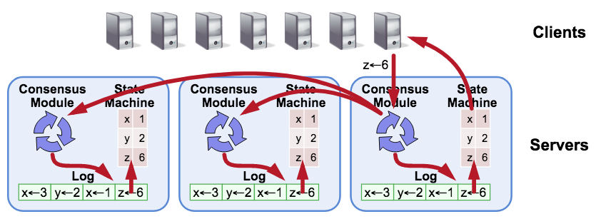

Consensus is one of the most important challenges in designing and building distributed systems--how to make sure multiple nodes (or agents, processes, threads, tasks, participants, etc.) in a group agree on a specific value proposed by at least one of the nodes. As an open-source distributed scalable HTAP database, [TiDB](http://bit.ly/tidb_repo_publication) uses the [Raft Consensus Algorithm](https://raft.github.io/) in its distributed transactional key-value storage engine, [TiKV](http://bit.ly/tikv_repo_publication), to ensure data consistency, auto-failover, and fault tolerance. TiDB has thus far been used by more than 200 companies in their production environments in a wide range of industries, from e-commerce and food delivery, to fintech, media, gaming, and travel.

Ever since the Raft Consensus Algorithm was created by Diego Ongaro and John Ousterhout, it has gained wide popularity in [many organizations](https://raft.github.io/#implementations), who are using it to develop consistent distributed services with high availability. For example, [CoreOS](https://coreos.com/) uses it to build [etcd](https://github.com/coreos/etcd), a popular key-value store which helps users save critical data. [HashiCorp](https://www.hashicorp.com/) uses it to build [Consul](https://www.consul.io/), which helps make service discovery and configuration easy. 

When we began to build TiKV, we researched and investigated many Raft implementations. We eventually decided to go with etcd’s Raft implementation and built our own [Raft](https://github.com/pingcap/raft-rs) using [Rust](https://www.rust-lang.org/en-US/), a systems programming language that runs blazing fast, prevents segfaults, and guarantees thread safety. Although etcd’s Raft implementation is written in Go, it has a simple API with no specific Go feature, thus can be easily ported to Rust. 

Since TiKV was open sourced on April 1, 2016, its Raft module has been running stably in many companies’ production environment. So we decided to abstract the Raft module away as an independent library and released it as a crate, [raft-rs](https://github.com/pingcap/raft-rs), to help the Rust community create their own consistent services using this easy to understand consensus algorithm. In the following sections, I will introduce what is raft-rs and how to use it.

## Design

In this post, I won’t cover the ins-and-outs of the Raft algorithm in detail, since there are many good resources that already cover that topic. Before we dive into raft-rs, let’s walk through its design first.

As you probably already know, Raft replicates the state machine through logs. If we can ensure all the machines have the same sequence of logs, after applying all logs in order, the state machine will reach a consistent state. 



A complete Raft model contains 4 essential parts: 

1. Consensus Module, the core consensus algorithm module;

2. Log, the place to keep the Raft logs;

3. State Machine, the place to save the user data;

4. Transport, the network layer for communication.

Our raft-rs implementation includes the core Consensus Module only, not the other parts. The core Consensus Module in raft-rs is customizable, flexible, and resilient. You can directly use raft-rs, but you will need to build your own Log, State Machine and Transport components. 

## How to use raft-rs

In this section, I will show you how to use raft-rs. Please note that we will only cover the Raft Log as it pertains to the Consensus Module, not how to apply the Log to the State Machine or Transport the messages from one node to another. 

### Step 1: Create the Raft node

You can use `RawNode::new()` to create the Raft node. To create the Raft node, you need to build a Log component, which is called Raft Storage in raft-rs, and then configure the Raft node.

**1. Build Raft Storage**

Raft Storage saves all the information about the current Raft implementation, including Raft Log, commit index, the leader to vote for, etc.

Storage is a trait defined in [storage.rs](https://github.com/pingcap/raft-rs/blob/master/src/storage.rs). Here is the trait interface in detail:

* `initial_state` is called when Raft is initialized. This interface will return a `RaftState` which contains `HardState` and `ConfState`;

    * `HardState` contains the last meta information including commit index, the vote leader, and the vote term;

    * `ConfState` records the current node IDs like `[1, 2, 3]` in the cluster. Every Raft node must have a unique ID in the cluster; 

* `entries` returns the Log entries in an interval `[low, high)`;

* `term` returns the term of the entry at Log index;

* `first_index` and `last_index` return the first and last index of the Log;

These interfaces are straightforward to understand and implement, but you should pay attention to what is returned when there is no Log but needs to get the `term` at index `first_index() - 1`. To solve this, we usually use a dummy Log entry to keep the last truncated Log entry.

* The last interface is `snapshot`, which returns a Snapshot of the current state machine. We will send this Snapshot data to another node.

**2. Configure the Raft node**

After we create the Raft Storage, the next step is to use `RawNode::new()` to create the Raft node. The `new` function needs a Raft Storage and a configuration. There are some important fields for this configuration:

* `id`: the unique ID of the node in the cluster, which must be unique; 

* `election_tick`: how many ticks the follower re-campaigns if it doesn’t receive any message from the leader;

* `heartbeat_tick`: how many ticks the leader sends the heartbeat to the followers to keep alive;

* `applied`: the last applied index for the state machine. Raft will resume applying Log entries to the state machine from this index; 

* `max_size_per_msg`: Raft can send many Log entries at the same time, so we need to limit the maximum size of the sending message. This is an optimization for Transport in batch;

* `max_inflight_msgs`: how many messages the leader can send to the followers without acknowledgement. This is an optimization for the Transport in pipeline.

* `election_tick` must be larger than `heartbeat_tick`. If our tick interval is 100 ms, we can use 10 for `election_tick` and 3 for `heartbeat_tick`, which means the leader will send heartbeat to the followers every 300 ms and the follower will re-campaign without receiving any messages after 1 second. 

* The `read_only_option` enables you to choose the linearizability mode or the lease mode to read data. If you don’t care about the read consistency and want a higher read performance, you can use the lease mode.

Other important fields like `check_quorum` and `pre_vote` are used to avoid the disturbance and make the cluster more stable. I will explain them in detail in another article later. 

### Step 2: Drive and Run the Raft node

Now that you have created a Raft node, the next step is to drive and run the Raft node. There three steps to this process:

1. You need a timer to run the Raft node regularly. See the following example for using Rust channel `recv_timeout`:

    ```rust
    let mut t = Instant::now();
    let mut timeout = Duration::from_millis(100);

    loop {
        match receiver.recv_timeout(timeout) {
            Ok(...) => (),
            Err(RecvTimeoutError::Timeout) => (),
            Err(RecvTimeoutError::Disconnected) => return,
        }
        let d = t.elaspsed();
        if d >= timeout {
            t = Instant::now();
            timeout = Duration::from_millis(100);
            // We drive Raft every 100ms.
            r.tick();
        } else {
            timeout -= d;
        }
    }
    ```
    As is shown in the above example, the Raft node is driven to run every 100 ms set by the `tick` function.

2. Use the `propose` function to drive the Raft node when the client sends a request to the Raft server. You can call `propose` to add the request to the Raft log explicitly.

    In most cases, the client needs to wait for a response for the request. For example, if the client writes a value to a key and wants to know whether the write succeeds or not, but the write flow is asynchronous in Raft, so the write log entry must be replicated to other followers, then committed and at last applied to the state machine, so here we need a way to notify the client after the write is finished. 
  
    One simple way is to use a unique ID for the client request, and save the associated callback function in a hash map. When the log entry is applied, we can get the ID from the decoded entry, call the corresponding callback, and notify the client. 

3. You can call the `step` function when you receive the Raft messages from other nodes. 

    Here is a simple example to use `propose` and `step`:

    ```rust
    let mut cbs = HashMap::new();
    loop {
        match receiver.recv_timeout(d) {
            Ok(Msg::Propose { id, callback }) => {
                cbs.insert(id, callback);
                r.propose(vec![id], false).unwrap();
            }
            Ok(Msg::Raft(m)) => r.step(m).unwrap(),
            ...
        }
    ...
    }
  ```

    In the above example, we use a channel to receive the `propose` and `step` messages. We only propose the request ID to the Raft log. In your own practice, you can embed the ID in your request and propose the encoded binary request data. 

### Step 3: Process the `Ready` State

When your Raft node is driven and run, Raft may enter a `Ready` state. You need to first use `has_ready` to check whether Raft is ready. If yes, use the `ready` function to get a `Ready` state. The `Ready` state contains many information, and you need to check and process them one by one:

1. Check whether `snapshot` is empty or not. If not empty, it means that the Raft node has received a Raft snapshot from the leader and we must apply the snapshot.

2. Check whether `entries` is empty or not. If not empty, it means that there are newly added entries but has not been committed yet, we must append the entries to the Raft log.

3. Check whether `hs` is empty or not. If not empty, it means that the `HardState` of the node has changed. For example, the node may vote for a new leader, or the commit index has been increased. We must persist the changed `HardState`.  

4. Check whether `messages` is empty or not. If not, it means that the node will send messages to other nodes. There has been an optimization for sending messages: if the node is leader, this can be done together with step 1 in parallel.

5. Check whether `committed_entires` is empty or not. If not, it means that there are some newly committed log entries which you must apply to the state machine. Of course, after applying, you need to update the applied index and resume `apply` later. 

6. Call `advance` to prepare for the next `Ready` state.

## Try it for yourself!

As you can see, it is easy to use raft-rs. You can build your own components and combine them together to have a fully functioning Raft implementation! 

As a distributed transactional key-value database that is strongly consistent, TiKV needs to go beyond a single Raft implementation. In TiKV, data is sharded into [Regions](https://pingcap.com/blog/2017-07-11-tidbinternal1/#region), a continuous range of data in byte order. Region is the basic unit of data movement and is replicated to several nodes, which makes up a Raft group. One node in the TiKV cluster might be working with multiple Raft groups. so we designed and implemented Multi-Raft. For more details, feel free to check out "[Multi-Raft Design and Implementation in TiKV](https://pingcap.com/blog/2017-08-15-multi-raft/)."

If you are interested in Raft and Rust, and want to build your own consistent service using [raft-rs](https://github.com/pingcap/tidb), please let me know (tl@pingcap.com). I would be thrilled to hear from you!

*Illustration by [**Amanda Limardi**](https://www.behance.net/amandalimadff4)*
