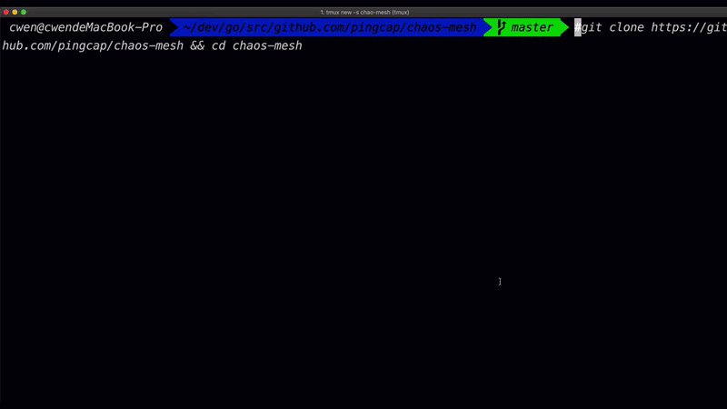
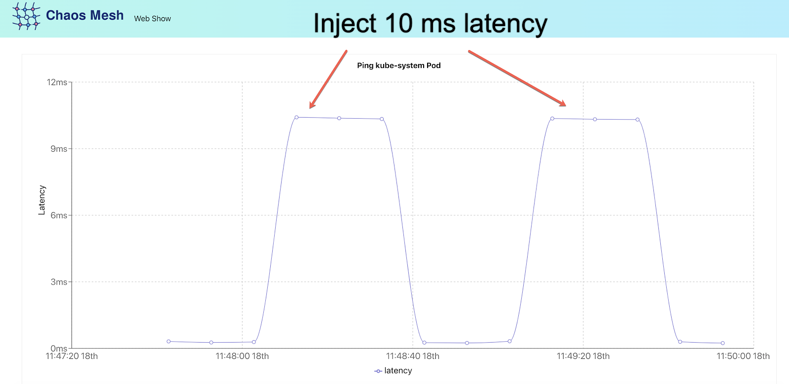
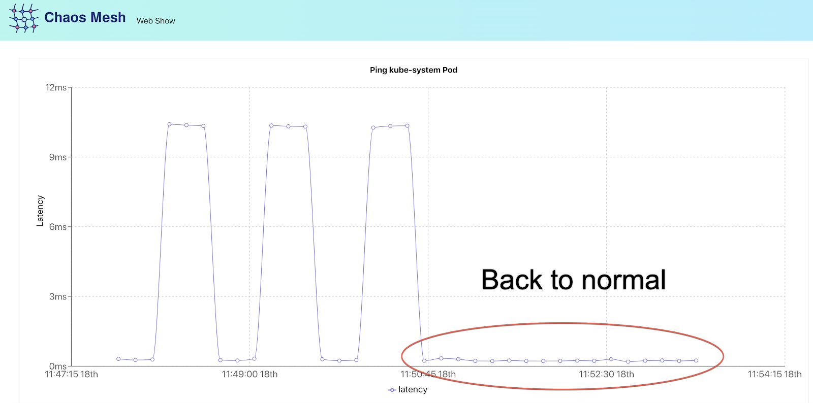

Chaos Engineering is a way to test a production software system's robustness by simulating unusual or disruptive conditions. For many people, however, the transition from learning Chaos Engineering to practicing it on their own systems is daunting. It sounds like one of those big ideas that require a fully-equipped team to plan ahead. Well, it doesn't have to be. To get started with chaos experimenting, you may be just one suitable platform away.

[Chaos Mesh](https://github.com/pingcap/chaos-mesh) is an **easy-to-use**, open-source, cloud-native Chaos Engineering platform that orchestrates chaos in Kubernetes environments. This 10-minute tutorial will help you quickly get started with Chaos Engineering and run your first chaos experiment with Chaos Mesh.

For more information about Chaos Mesh, refer to our [previous article ](https://pingcap.com/blog/chaos-mesh-your-chaos-engineering-solution-for-system-resiliency-on-kubernetes/)or the [chaos-mesh project](https://github.com/pingcap/chaos-mesh) on GitHub.

## A preview of our little experiment

Chaos experiments are similar to experiments we do in a science class. It's perfectly fine to stimulate turbulent situations in a controlled environment. In our case here, we will be simulating network chaos on a small web application called [web-show](https://github.com/chaos-mesh/web-show). To visualize the chaos effect, web-show records the latency from its pod to the kube-controller pod (under the namespace of `kube-system`) every 10 seconds.

The following clip shows the process of installing Chaos Mesh, deploying web-show, and creating the chaos experiment within a few commands: 


<div class="caption-center"> The whole process of the chaos experiment </div>

Now it's your turn! It's time to get your hands dirty.

## Let's get started!

For our simple experiment, we use Kubernetes in the Docker ([Kind](https://kind.sigs.k8s.io/)) for Kubernetes development. You can feel free to use [Minikube](https://minikube.sigs.k8s.io/) or any existing Kubernetes clusters to follow along.

### Prepare the environment

Before moving forward, make sure you have [Git](https://git-scm.com/) and [Docker](https://www.docker.com/) installed on your local computer, with Docker up and running. For macOS, it's recommended to allocate at least 6 CPU cores to Docker. For details, see [Docker configuration for Mac](https://docs.docker.com/docker-for-mac/#advanced).

1. Get Chaos Mesh:

    ```bash
    git clone https://github.com/pingcap/chaos-mesh.git
    cd chaos-mesh/
    ```

2. Install Chaos Mesh with the `install.sh` script:

    ```bash
    ./install.sh --local kind 
    ``` 

    `install.sh` is an automated shell script that checks your environment, installs Kind, launches Kubernetes clusters locally, and deploys Chaos Mesh. To see the detailed description of `install.sh`, you can include the `--help ` option.

    **Note:**

    If your local computer cannot pull images from `docker.io` or `gcr.io`, use the local gcr.io mirror and execute `./install.sh --local kind --docker-mirror` instead.

3. Set the system environment variable:

    ```bash
    source ~/.bash_profile
    ```

**Note:**

* Depending on your network, these steps might take a few minutes.
* If you see an error message like this:
    
    ```bash
    ERROR: failed to create cluster: failed to generate kubeadm config content: failed to get kubernetes version from node: failed to get file: command "docker exec --privileged kind-control-plane cat /kind/version" failed with error: exit status 1
    ```

    increase the available resources for Docker on your local computer and execute the following command:

    ```bash
    ./install.sh --local kind --force-local-kube
    ```

When the process completes you will see a message indicating Chaos Mesh is successfully installed.

### Deploy the application

The next step is to deploy the application for testing. In our case here, we choose web-show because it allows us to directly observe the effect of network chaos. You can also deploy your own application for testing.

1. Deploy web-show with the `deploy.sh` script:

    ```bash 
    # Make sure you are in the Chaos Mesh directory 
    cd examples/web-show && 
    ./deploy.sh 
    ``` 

    **Note:**

    If your local computer cannot pull images from `docker.io`, use the `local gcr.io` mirror and execute `./deploy.sh --docker-mirror` instead. 

2. Access the web-show application. From your web browser, go to `http://localhost:8081`.

### Create the chaos experiment

Now that everything is ready, it's time to run your chaos experiment!

Chaos Mesh uses [CustomResourceDefinitions](https://kubernetes.io/docs/tasks/access-kubernetes-api/custom-resources/custom-resource-definitions/) (CRD) to define chaos experiments. CRD objects are designed separately based on different experiment scenarios, which greatly simplifies the definition of CRD objects. Currently, CRD objects that have been implemented in Chaos Mesh include PodChaos, NetworkChaos, IOChaos, TimeChaos, and KernelChaos. Later, we'll support more fault injection types.

In this experiment, we are using [NetworkChaos](https://github.com/pingcap/chaos-mesh/blob/master/examples/web-show/network-delay.yaml) for the chaos experiment. The NetworkChaos configuration file, written in YAML, is shown below:

```
apiVersion: pingcap.com/v1alpha1
kind: NetworkChaos
metadata:
  name: network-delay-example
spec:
  action: delay
  mode: one
  selector:
    namespaces:
      - default
    labelSelectors:
      "app": "web-show"
  delay:
    latency: "10ms"
    correlation: "100"
    jitter: "0ms"
  duration: "30s"
  scheduler:
    cron: "@every 60s"
``` 

For detailed descriptions of NetworkChaos actions, see [Chaos Mesh wiki](https://github.com/pingcap/chaos-mesh/wiki/Network-Chaos). Here, we just rephrase the configuration as:

* target: `web-show`
* mission: inject a `10ms` network delay every `60s`
* attack duration: `30s` each time 

To start NetworkChaos, do the following:

1. Run `network-delay.yaml`:

    ```bash 
    # Make sure you are in the chaos-mesh/examples/web-show directory
    kubectl apply -f network-delay.yaml
    ```

2. Access the web-show application. In your web browser, go to `http://localhost:8081`.

    From the line graph, you can tell that there is a 10 ms network delay every 60 seconds.


<div class="caption-center"> Using Chaos Mesh to insert delays in web-show </div> 

Congratulations! You just stirred up a little bit of chaos. If you are intrigued and want to try out more chaos experiments with Chaos Mesh, check out [examples/web-show](https://github.com/pingcap/chaos-mesh/tree/master/examples/web-show).

### Delete the chaos experiment

Once you're finished testing, terminate the chaos experiment.

1. Delete `network-delay.yaml`:

    ```bash
    # Make sure you are in the chaos-mesh/examples/web-show directory
    kubectl delete -f network-delay.yaml
    ```

2. Access the web-show application. From your web browser, go to `http://localhost:8081`.

From the line graph, you can see the network latency level is back to normal.


<div class="caption-center"> Network latency level is back to normal </div>

### Delete Kubernetes clusters

After you're done with the chaos experiment, execute the following command to delete the Kubernetes clusters: 

```bash
kind delete cluster --name=kind
```

**Note:**

If you encounter the `kind: command not found` error, execute `source ~/.bash_profile` command first and then delete the Kubernetes clusters.

## Cool! What's next?

Congratulations on your first successful journey into Chaos Engineering. How does it feel? Chaos Engineering is easy, right? But perhaps Chaos Mesh is not that easy-to-use**. **Command-line operation is inconvenient, writing YAML files manually is a bit tedious, or checking the experiment results is somewhat clumsy? Don't worry, Chaos Dashboard is on its way! Running chaos experiments on the web sure does sound exciting! If you'd like to help us build testing standards for cloud platforms or make Chaos Mesh better, we'd love to hear from you!

If you find a bug or think something is missing, feel free to file an issue, open a pull request (PR), or join us on the #sig-chaos-mesh channel in the [TiDB Community](https://pingcap.com/tidbslack) slack workspace.

GitHub: [https://github.com/pingcap/chaos-mesh](https://github.com/pingcap/chaos-mesh)
