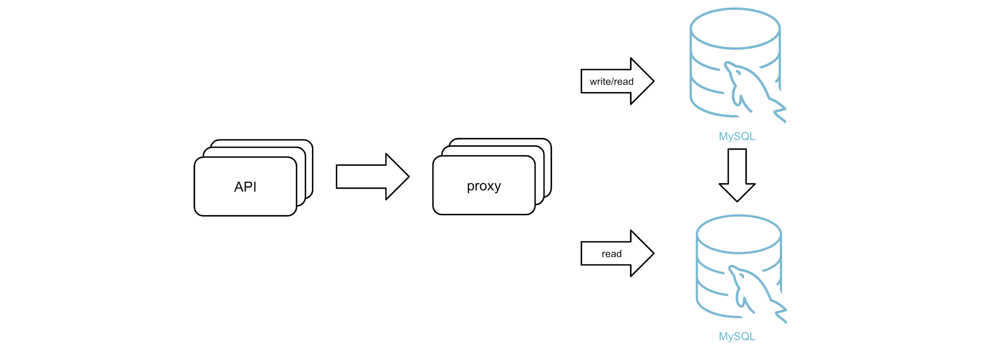
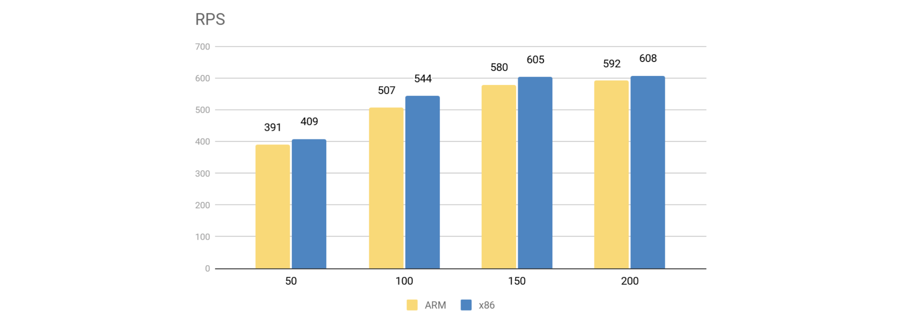
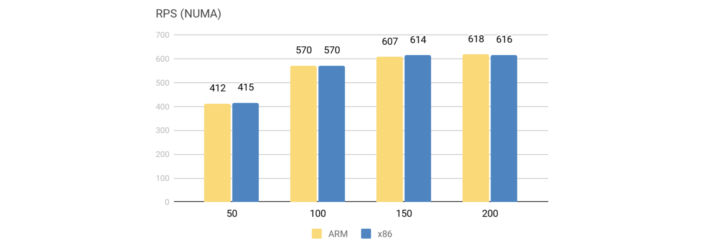

**Industry**: Media and Entertainment

**Author**: Birong Huang (Senior engineer at U-Next)

[U-Next](https://www.unext.co.jp/en) is a subscription-based video streaming platform that has one of the largest market shares in Japan. In the past few years, our business grew rapidly, and our old IT infrastructure could no longer keep pace. We needed to upgrade our system.

Our previous MySQL cluster was hard to scale, and, when the server experienced high concurrency, the cluster had high latency. To solve these problems, we migrated our data to [TiDB](https://docs.pingcap.com/tidb/dev), an open-source, distributed SQL database that provides horizontal scalability and high performance. It speaks the MySQL protocol and works perfectly on our [ARM architecture](https://en.wikipedia.org/wiki/ARM_architecture). Thanks to TiDB, we are able to provide our users with more quality service.

In this article, I'll share with you why we chose to put our data in TiDB and run it on ARM. Also, I'll provide the detailed benchmarking tests of TiDB on ARM. I hope our story can help you find the right database solution for your application.

## Why we chose TiDB to replace MySQL

Before we migrated to TiDB, we used MySQL. To boost the database performance, we chose [Atlas](https://github.com/Qihoo360/Atlas), a fork of [MySQL Proxy](https://github.com/mysql/mysql-proxy), to split read and write requests for our MySQL clusters. The system architecture looked like this:

Our previous system architecture

However, this implementation had several issues:

* The Atlas project was rarely maintained. If a bug occurred, our engineering team didn't have the resources to solve it by themselves.
* It was painful to scale out the back-end MySQL cluster.
* As the server concurrency rose, the latency also skyrocketed.

We reviewed the difficulties we faced and the new requirements of our business, and we decided to migrate to a new database that:

* **Has no obvious bottleneck**. We wanted a horizontally scalable database. For example, we had a table that grew by 100 million rows every month. Every user login needed to access that table. If the database couldn't scale out, it might seriously impact our service quality.
* **Is highly available**. We hoped that we could upgrade and scale out the new database online.
* **Has an active community and available tech support**. One potential problem of using an open-source project is that the author may stop maintaining it. Therefore, it's important that we can get long-term, sustainable tech support.
* **Costs low for migration**. Migrating to a new database is troublesome and expensive, not only because we need to pay for new hardware and software, but also because we have to alter the application code. So we hoped to change the code as little as possible.

Taking these points into consideration, we believed that TiDB was the best option for U-Next. TiDB is a distributed database that provides horizontal scalability and [high availability](https://docs.pingcap.com/tidb/dev/high-availability-faq). Also, TiDB has over 25,000 Stars on GitHub, which is proof of its active community. Last but not least, it is MySQL compatible. We only needed to alter a small part of our code to integrate the application into TiDB.

## Why we run the mission-critical TiDB database on ARM

As I mentioned, we run TiDB on the ARM architecture. Because most companies use x86 for their servers, it may seem unusual that we run our database on ARM. We chose ARM for three major reasons: cost, compatibility, and maintenance.

* **ARM processors are less expensive**, so they're more suitable for small and medium-sized companies.
* **TiDB has been officially tested and verified on ARM**. [PingCAP](https://pingcap.com/), the team behind TiDB, issued an [official benchmarking report](https://pingcap.com/blog/porting-tidb-to-arm64-for-greater-flexibility/) for ARM64 and x86-64 and confirmed that TiDB has no compatibility issues with ARM.
* **ARM is reliable**. U-Next has used ARM as its distributed storage platform for years, and it's been going well. Our engineering team is experienced in maintaining ARM.

Therefore, we decided to run the mission critical TiDB on ARM, just as our other applications.

## Benchmarking TiDB on ARM and x86

To make sure that TiDB goes well with ARM for our application, we ran benchmarking tests between servers with ARM and x86 architectures. We set our test environment as follows:

<table>
  <tr>
   <td>
   </td>
   <td><strong>ARM</strong>
   </td>
   <td><strong>x86</strong>
   </td>
  </tr>
  <tr>
   <td>CPU
   </td>
   <td>Two Huawei Kunpeng 920 processors (32 cores)
   </td>
   <td>Two <a href="https://ark.intel.com/content/www/us/en/ark/products/91767/intel-xeon-processor-e5-2650-v4-30m-cache-2-20-ghz.html">Intel 2650 v4</a> processors (12 cores).   Owing to Intel’s <a href="https://en.wikipedia.org/wiki/Hyper-threading">hyper-threading technology</a>, x86 has in fact 48 cores available.
   </td>
  </tr>
  <tr>
   <td><a href="https://en.wikipedia.org/wiki/Non-uniform_memory_access">NUMA</a>
   </td>
   <td>Four nodes
   </td>
   <td>Two nodes
   </td>
  </tr>
  <tr>
   <td>Memory
   </td>
   <td>128 GB
   </td>
   <td>128 GB
   </td>
  </tr>
  <tr>
   <td>Disk
   </td>
   <td>Two SSD system disks One NVMe data disk
   </td>
   <td>Two SSD system disks One NVMe data disk
   </td>
  </tr>
  <tr>
   <td>Network
   </td>
   <td colspan="2" >The servers are from the same vendor, so their network conditions are the same.
   </td>
  </tr>
</table>

Based on our own application model, we used [locus](https://github.com/locustio/locust) to simulate the online request load. Each client sent one request per second. We tested a table that had 300 million rows of sample data. Each operation includes a `Get`, a `Post`, and a `Put` method. We sent 200,000 API requests in total.

The diagram below shows the request per second (RPS) results. The x-axis represents the number of clients, and the y-axis is the number of RPS processed:

RPS results of ARM and x86

When there are 50, 100, 150, and 200 clients, ARM performs slightly slower than x86, which is acceptable.

We also tested the response latency of the `GET`, `POST`, and `PUT` methods:

Response latency of GET, POST, and PUT

If we combine the two sets of results, it is clear that the bottleneck of a single API server occurs when there are about 150 clients. When the number of clients exceeds 150, even if we add more clients, the RPS won't get higher, but the latency might continue to rise.

From this test, we know that TiDB's performance is not significantly different between ARM and x86. For our application, the slight difference is acceptable.

At the end of 2019, we migrated our data to TiDB. Before the migration, we often had up to 6,000 slow requests (response >= 500 ms) during peak hours. However, after the migration, the number of slow requests at the same time slot drops to less than 600. In other words, TiDB reduced the number of slow requests in our application by 10 times.

We also migrated TiDB to another data center. The API server and TiDB were located in different data centers and connected by a dedicated connection. Even when the network latency increased 1-2 ms, TiDB still improved the overall service. This was more than exciting.

## ARM-oriented performance tuning

We also tuned the performance of our TiDB clusters specifically for the ARM architecture. The tuning mainly focused on [Transparent HugePages](https://www.percona.com/blog/2019/03/06/settling-the-myth-of-transparent-hugepages-for-databases/) (THP) and NUMA binding.

Thanks to PingCAP,  we found that THP made a difference in ARM performance. When the test data volume was about 100 GB, THP might result in a TiKV out of memory condition. So we strongly recommend disabling THP on ARM.

On our platform, ARM has four [NUMA](https://en.wikipedia.org/wiki/Non-uniform_memory_access) nodes. On ARM, CPU participates in memory processing. If the CPU cores are not mapped to NUMA nodes by default, the more NUMA nodes there are, the higher latency. Therefore, to reduce latency we bound the processes and network interface card to the corresponding NUMA nodes.

TiDB performs so well that except for scenarios with extremely massive data, it doesn't need performance tuning. After we adjusted the NUMA configuration, the benchmarking results between ARM and x86 were almost the same:

RPS results of ARM and x86 after configuring NUMA

## Conclusion

TiDB has helped U-Next build a more stable and faster video streaming platform, enabling us to provide quality service for our customers. It solves the pain points of the traditional MySQL architecture through its horizontal scalability and amazing performance. I hope this article helped you learn more about TiDB and how to run TiDB on ARM.
