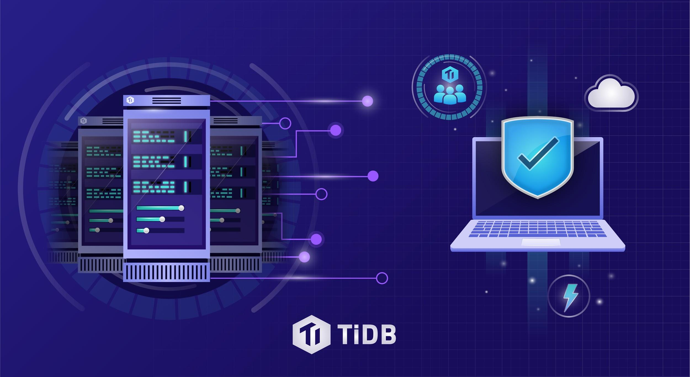
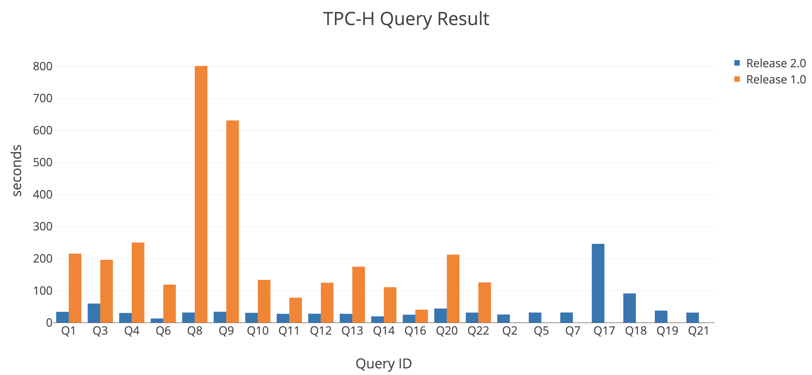

TiDB 2.0 is Ready!

When we [launched](https://pingcap.com/blog/2017-10-17-announcement/#pingcap-launches-tidb-1-0-a-scalable-hybrid-database-solution) TiDB 1.0 last October, we were excited but also a bit nervous. After working on TiDB heads-down, non-stop for more than two years, even with the support of a [large (and growing)](https://github.com/pingcap) open-source community, we weren’t sure how the world would receive what we’ve built. What we saw during the following six months was nothing short of overwhelming. More than 200 companies have deployed [TiDB](http://bit.ly/tidb_repo_publication) in their production environments. These companies come from a wide range of industries from e-commerce and food delivery, to fintech, media, gaming, and travel. (You can see an always-incomplete and constantly-updated list of adopters [here](http://bit.ly/adopters_list).)

Many of these companies may be unfamiliar to a North American or European audience, but their scale is huge and so is the data they generate. Innovative startups like [Mobike](https://www.pingcap.com/blog/Use-Case-TiDB-in-Mobike/) (dockless bike-sharing platform with 200 million users) and [Yiguo](https://www.datanami.com/2018/02/22/hybrid-database-capturing-perishable-insights-yiguo/) (fresh produce delivery with 5 million customers) use TiDB as a hybrid real-time analytics data warehouse, entrusting us with more than a dozen TBs of data. Fast-growing companies like Toutiao.com (news and short videos app with 120 million DAUs) use TiDB as a solution for their massive amounts of metadata. Platforms like Ele.me (food delivery service recently acquired by Alibaba for [9.5 billion USD](https://www.bloomberg.com/news/articles/2018-04-02/alibaba-buys-ele-me-in-deal-that-implies-9-5b-enterprise-value)) deploys [TiKV](https://github.com/pingcap/tikv), the distributed transactional key-value store within the TiDB ecosystem, as its unifying storage layer to hold more than 10 TBs of data. 

Despite this initial traction, we know TiDB has much room for improvement. To figure out what we should work on in TiDB 2.0, we absorbed insights and feedbacks from our customers, listened to requests and issues from our community, and reflected internally on our ultimate vision of building a distributed hybrid transactional and analytical processing database that scales itself, heals itself, and lives in the cloud. We decided to focus on three areas:

* Improving stability and correctness;

* Boosting OLAP performance; 

* Making TiDB easier to use and operate. 

After six months of hard work, we’ve made significant progress in these three areas--some of which are visible (see TPC-H benchmarks below), some of which are invisible and running in the background, but all of which are implemented to make TiDB 2.0 its best version yet. Here’s what we’ve done. 

## Stability and Correctness

The stability and correctness of a database is its most fundamental purpose. As (literally) the beating heart of every business, any volatility, jitter or error inside a database could pose great challenges to the business’s health and operation. Thus, we spent a lot of energy researching, analyzing, and engineering solutions to ensure that TiDB can operate more stably and intelligently. 

After 1.0, we built an in-house automated testing platform, called Schrodinger, and said good-bye to manual cluster testing in order to scale our testing practices. We added more cases into Schrodinger to comprehensively test every single layer of our product, from RocksDB at the very bottom, to the Raft layer, to the transaction layer, and all the way to the SQL layer.

We implemented [Chaos testing](https://thenewstack.io/chaos-tools-and-techniques-for-testing-the-tidb-distributed-newsql-database/) and introduced more auto-fault injections, such as using [Systemtap](https://sourceware.org/systemtap/) to delay I/O, to make TiDB more resilient. We also injected faults into specific business logics in our code to ensure that TiDB could function even under the most abnormal circumstances. To ensure correctness in our design and implementation, we [use TLA+ to formally prove](https://github.com/pingcap/tla-plus) our work. [TLA+](https://en.wikipedia.org/wiki/TLA%2B), a formal specification language developed by Leslie Lamport and used to verify concurrent systems, is something we’ve been studying and experimenting with since we first started building TiDB.

To improve the stability and performance of our storage engine, we optimized our Raft process by adding new functions such as Region Merge for Multi-Raft and Raft Learner; fine-tuned our hotspot scheduling mechanism by collecting more statistics to achieve accurate and precise scheduling; and improved RocksDB’s performance by using the DeleteFilesInRanges feature to achieve higher disk space collection efficiency, lower workload on the disk, and balance usage of disk resources.

## OLAP Performance Boost

Many of our customers have anywhere from hundreds of GBs to more than a dozen TBs of data in their TiDB clusters. These companies’ datasets grow on a daily basis and so are their needs and requirements for real-time data analytics to make the most out of their data. Thus, improving OLAP query performances on huge datasets became an obvious top priority. 

In TiDB 1.0, we made the switch from Rule-Based Optimizer to Cost-Based Optimizer, and in TiDB 2.0, we refactored our optimizer and execution engine to achieve quicker selection of the optimal query plan and the most efficient execution plan. In short, we made TiDB smarter. Our optimizations resulted in the following improvements:

* Higher accuracy and timely updates of the statistics;

* More precise estimation of query cost; 

* More in-depth analysis of complex criteria and filters; 

* Graceful processing of correlated subqueries; 

* More flexible and accurate selection of the physical operator.

We also introduced `Chunk`, a new internal data encoding method where a chunk of data is stored in a data structure instead of in rows. The data within the same column of data is stored sequentially in memory by chunks so that: 

* Memory consumption is significantly reduced; 

* GC overhead is reduced by allocating memory in chunks; 

* Calling overhead is reduced by transferring the data between operators in chunks; 

* Vector computing is made possible in certain circumstances and cache miss rate of CPU is reduced.

## Ease of Use and Operation 

While the entire TiDB project can appear rather complex, it doesn’t have to be. Thus, we spent a lot of time improving its usability and operationality, so users can easily deploy, upgrade, scale, monitor, management, and diagnose the entire system, no matter how many TiDB clusters you have running. 

To improve monitoring, we added more than 100 metrics to help monitor the HTTP interface and SQL statements, in order to expose the system’s runtime information for tuning and diagnosis. 

To make operating TiDB clusters easier, we optimized our operation tools and simplified certain processes to reduce their complexity and impact on business operations. We also included useful new tools, like auto-deployment of binlog components and TLS enablement. 

## Some Benchmarks, No Benchmark-eting

We’ve mentioned significant OLAP performance boost in TiDB 2.0 compared to 1.0. Here’s a set of TPC-H benchmarks to back that up. (Blue is 2.0, orange is 1.0)

As you can see, all queries run much faster in 2.0 than in 1.0, many of them several times if not orders of magnitude faster. What’s more, queries that could not be processed at all in 1.0 (i.e. Q2, 5, 7, 17, 18, 19, 21) all returned results with good performance in 2.0. Only one query, Q15, returned NaN in 2.0 because this version currently does not support VIEW. (Don’t worry, VIEW support is on our roadmap.) You can find [details of TiDB 2.0’s TPC-H 50G Performance Test Report here](https://github.com/pingcap/docs/blob/master/benchmark/tpch.md) and reproduce the results yourself. 

We always strive to be transparent, fair, and reproducible with every set of benchmarks we release and avoid "benchmark-eting." There are too many misleading benchmarks out there that look shiny on the surface but don’t stand up to scrutiny. Abusing benchmarks may yield an easy win, but is ultimately detrimental to the product, the community, and the users who rely on them. That’s something we are committed to never do.

## Looking Ahead

TiDB 2.0 is faster, smarter, and battle-tested by both our own sophisticated testing regiment and the production usage of more than 200 companies. We can’t wait to see the value and benefits it’ll create for our customers and community in the coming months. You can dig into the details of 2.0 in our release notes of TiDB [here](https://github.com/pingcap/tidb/releases/tag/v2.0.0) and TiKV [here](https://github.com/pingcap/tikv/releases/tag/v2.0.0). 

Of course, there are many items on our [Roadmap](https://github.com/pingcap/docs/blob/master/ROADMAP.md) still, which we hope to accomplish with a bigger team and a stronger community (see our [contributor guideline](https://github.com/pingcap/tidb/blob/master/CONTRIBUTING.md)). Looking ahead, we will also integrate TiDB with more cloud services. While it is already on Tencent Cloud and UCloud, our team is working overtime to bring TiDB to a cloud service near you, both public and private. 

## Wait, One More Thing...

Along with TiDB 2.0, we also released [TiSpark 1.0](https://github.com/pingcap/tispark/releases/tag/1.0), a Spark plug-in that leverages the best of SparkSQL and the power of TiKV to help our customers process complex OLAP queries in real-time. We will have more to say about TiSpark soon. So follow us on Twitter (@PingCAP), [LinkedIn](https://www.linkedin.com/company/pingcap/), and stay tuned. 

*Illustration by [Amanda Limardi](https://www.behance.net/amandalimadff4)*
