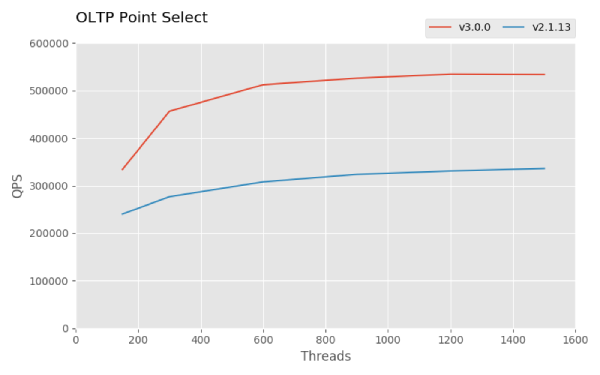
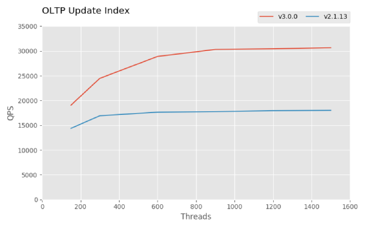
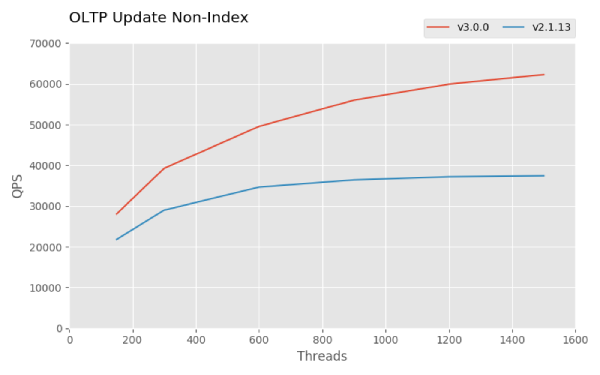
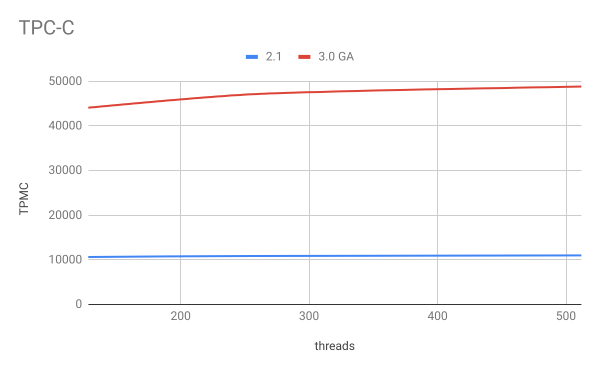
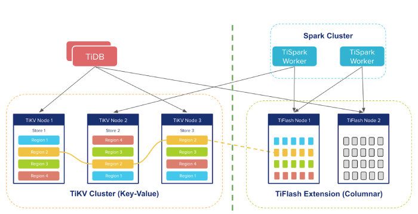

Author: Li Shen (VP of Engineering at PingCAP)

Earlier this year at the [2nd TiDB DevCon](https://pingcap.com/blog/tidb-3.0-beta-stability-at-scale/), we gave an audience of 700+ users and developers a sneak peek of what we were working on for TiDB 3.0. Since then, we've been racing towards the finish line and conducting rigorous testing, including the [official Jepsen test](https://www.pingcap.com/blog/tidb-passes-jepsen-test-for-snapshot-isolation-and-single-key-linearizability/). Today, I'm proud to announce that TiDB 3.0 has reached general availability. 

Our goal for 3.0 is to deliver stability at a massive scale, but "massive" means different things to different people. For us, it is the several hundreds of production users from all kinds of industries who have battle-tested TiDB with a multitude of real-world scenarios; for our users, we are talking about up to 300 TBs of data and 150+ physical nodes within a cluster. That's not a theoretical limit; it's the real in-production cluster size of our customers! Delivering stability at this scale is no small feat, but we are one giant step closer towards that goal. 

## Major features that are focused on stability

See the following selected list of optimizations in TiDB 3.0 for stability: 

- Optimizes the heartbeat mechanism between Raft replicas, and adjusts the heartbeat frequency according to Region activeness to reduce the cold data pressure on the cluster.

- Supports more parameter configurations in hot Region scheduling, and uses a higher priority to improve the accuracy of hot Region scheduling.

- Optimizes the scheduling process of PD, and provides a mechanism that limits the traffic in scheduling to improve the system stability.

- Supports distributed Garbage Collector (GC) to improve the GC performance, decrease the GC time for the large-scale cluster, and thus greatly improve the system stability.

## Significant performance improvements in Sysbench and TPC-C benchmarks 

For TiDB 3.0 GA, Sysbench results show that the Point Select, Update Index, and Update Non-Index performance are all about 1.5 times that of TiDB 2.1, and the TPC-C performance is 4.5 times as good, as shown in the below snapshots. Check out the complete [Sysbench result](https://github.com/pingcap/docs/blob/master/v3.0/benchmark/sysbench-v4.md) and the [TPC-C performance result](https://github.com/pingcap/docs/blob/master/v3.0/benchmark/tpcc.md). For how to reproduce these results, see [How to Test TiDB Using Sysbench](https://github.com/pingcap/docs/blob/master/v3.0/benchmark/how-to-run-sysbench.md) and [TiDB TPC-C Performance Test Report -- v3.0 vs. v2.1](https://github.com/pingcap/docs/blob/master/v3.0/benchmark/tpcc.md).

 *Figure 1: OLTP Point Select in Sysbench and TiDB 2.1* 

 *Figure 2: OLTP Update Index in Sysbench results for TiDB 3.0 and TiDB 2.1* 

 *Figure 3: OLTP Update Non-Index in Sysbench results for TiDB 3.0 GA and TiDB 2.1* 

 *Figure 4: TPC-C results for TiDB 3.0 and TiDB 2.1* 

## Evolving to HTAP

TiDB is an open-source NewSQL Hybrid Transactional and Analytical Processing (HTAP) database with MySQL compatibility, and one of the most popular and [active database products on GitHub](https://github.com/pingcap/tidb). Our architecture is modular by design in order to provide a level of flexibility that's necessary to process both OLTP and OLAP workloads performantly in the same distributed database system. Prior to 3.0, OLAP performance on our storage layer TiKV (now a [CNCF incubation-level member project](https://www.cncf.io/blog/2019/05/21/toc-votes-to-move-tikv-into-cncf-incubator/)), is limited by the fact that it is a row-based key-value store. Thus, we are introducing a new storage component that's columnar-based, called TiFlash (currently in beta), that sits alongside TiKV. 

TiFlash continues to be replicated using the Raft consensus protocol but now an extra, non-voting replica (called Raft Learner) is made per each Raft group and sits in TiFlash purely for the purpose of faster data analytics and for better resource isolation between OLTP workloads and OLAP workloads. Live transactional data is made available almost immediately and near real-time for fast analysis. All data is still kept strongly consistent throughout the entire TiDB system, and there's no need to manage an ETL pipeline to a column store anymore.
	

 *Figure 5: the TiDB HTAP architecture* 

We will write more deep dive blog posts on TiFlash soon, but the evolution of the TiDB architecture and the value it delivers is clear: faster time to insight, more productive developers.

## Other Features and Improvements
	
Besides the features we mentioned in [TiDB 3.0 Beta: Stability at Scale](https://pingcap.com/blog/tidb-3.0-beta-stability-at-scale/), there are many other features and improvements in 3.0 GA that I can't jam-pack into this single blog post, but we will do deep dives on all of them in the future. Here are the highlights:

- Role-based access control (RBAC) is now available in TiDB 3.0 as an experimental feature to secure your system with a simple "user-role-privilege" access control model. 

- Improved stability of the query plan, such as the Fast Analyze feature, Incremental Analyze feature and SQL Plan Management feature, as well as Top-N statistics in CM-Sketch and Skyline Pruning framework.

- Enhanced usability supported by using SQL statements to query slow query logs, fast recovery of deleted tables (this feature is particularly useful when you mistakenly delete data and want to recover it quickly), a unified log format specification with a restructured log system to help users understand the log and use tools to perform quantitative analysis of the log, etc.

- TiDB 3.0 introduces an experimental feature for pessimistic locking to make transactions behave more similarly to that in MySQL. For more details, see [TiDB Pessimistic Transaction Mode](https://pingcap.com/docs/v3.0/reference/transactions/transaction-pessimistic/).

- Inspired by [WiscKey](https://www.usenix.org/system/files/conference/fast16/fast16-papers-lu.pdf), Titan, a RocksDB plugin to reduce write amplification, is added for scenarios with value sizes greater than 1 KB, relieves write amplification in RocksDB, and decreases the disk I/O usage, see the [Engineering blog for its design and implementation](https://www.pingcap.com/blog/titan-storage-engine-design-and-implementation/).

For a full list of new features and improvements, I strongly encourage you to check out the TiDB 3.0 GA release notes. If you'd like to upgrade from previous TiDB versions to 3.0, please see instructions here [TiDB 3.0 Upgrade Guide](https://www.pingcap.com/docs/v3.0/how-to/upgrade/from-previous-version/), and contact our team via email at info@pingcap.com or join our community [Slack channel](https://pingcap.com/tidbslack). 
 
TiDB 3.0 is the strongest version yet, and we are grateful for all the help, feedback, and support our users and community have given us. 

