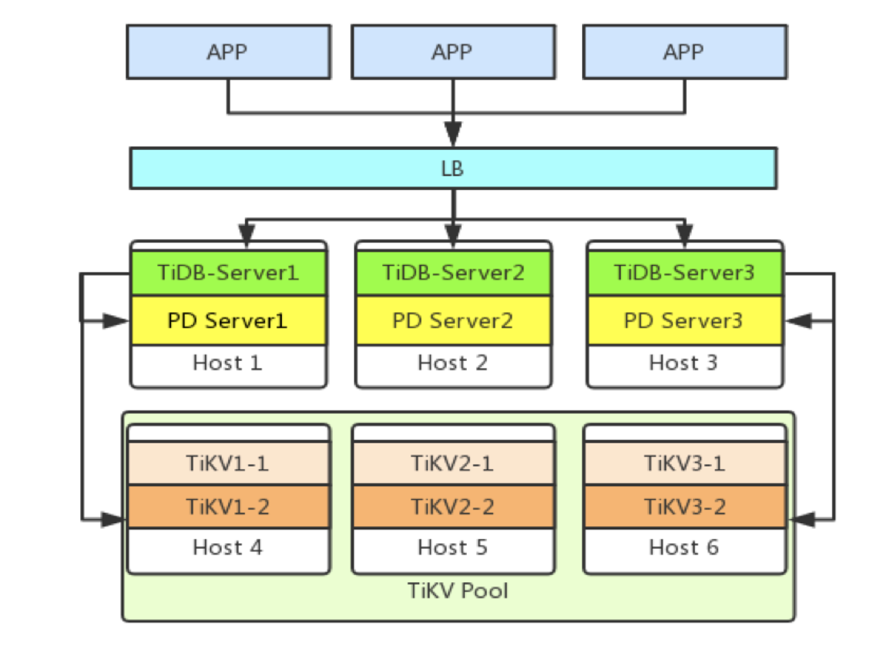
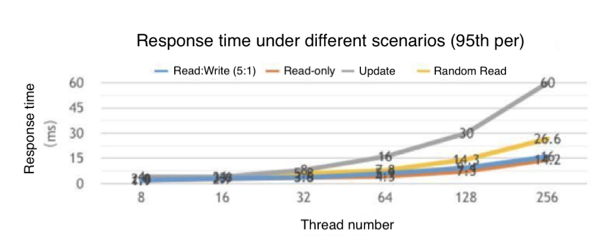
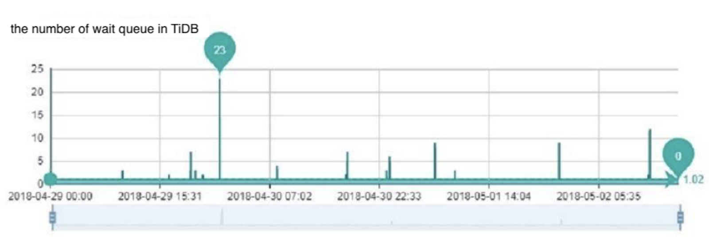

**Industry:** E-commerce

**Authors:** Xuan Sun (Chief Architect at Zhuan Zhuan), Dong Chen (Senior Engineer at Zhuan Zhuan) and Haodong Ji (Senior Database Administrator at Zhuan Zhuan) 

The [Letgo](https://us.letgo.com/en) of China, Zhuan Zhuan is a mobile app that enables our 100 million users to engage in “recommerce,” the e-commerce of buying and selling of second-hand goods ranging from smartphones and clothes to furniture and baby gear. Co-invested by [58.com Inc.](https://www.crunchbase.com/organization/58-com), the leading online classifieds and listings website in China, and the internet services giant [Tencent](https://www.tencent.com/en-us/), our platform has experienced tremendous growth since its launch in 2015.

While growth is always a good thing, we soon became concerned that the surging data volume would pose a serious challenge to our backend system and put the operations team under great pressure. Luckily, we found [TiDB](http://bit.ly/tidb_repo_publication), a MySQL-compatible distributed hybrid transactional and analytical processing ([HTAP](https://en.wikipedia.org/wiki/Hybrid_transactional/analytical_processing_(HTAP))) database built by [PingCAP and its active open-source community](https://pingcap.com). As a result, we no longer have to worry about scaling databases and can  focus on building better applications for our users.

Currently, we have deployed TiDB in multiple clusters for the messaging and risk management applications. These TiDB clusters hold several dozens of TBs of data with excellent and stable performance. In this post, we will elaborate on our pain points, why we chose TiDB, our practice in production, and our future plans with TiDB.

 *TiDB Cluster Architecture at Zhuan Zhuan* 

## Our Pain Points

Previously, our main solution for the backend system was MySQL, with MongoDB supporting a small number of applications. Although this solution could basically meet our demand, some problems arose as our business grew:

1. Our data grew quickly, but it was difficult to rapidly scale the storage capacity horizontally in MySQL. 

2. With a massive data volume that keeps increasing, MySQL created a heavy workload for the operations team when performing Data Definition Language (DDL) operations.

3. To handle the service access performance under large data volume, we had to use more MySQL shardings, which made the application logic much heavier and more complicated. Meanwhile, to meet the multi-dimensional query demand, we always needed to introduce extra storage or sacrifice some performance, thus blocking the rapid iteration of our product. 

4. Due to the regular MySQL Master-Slave (M-S) failover design, application access was often unavailable. If a node failed, it took a long time to recover because of the massive data volume. But the M-S architecture could only guarantee high availability using extra components and through Master-Slave switch, and during the switch process, as the system needed to ensure the state of the Master database, the election of the new Master, and the issue of the new routing, application access got interrupted.

## Why TiDB?

To address our pain points, the Infrastructure and DBA teams decided to find a NewSQL database solution for our fast-growing business. We came across TiDB at the very beginning of the evaluation process, and we quickly realized that it would solve our main problems.

We chose TiDB for the following reasons:

- Horizontal scalability: TiDB provides horizontal scalability simply by adding more nodes. We don’t need to worry about the storage capacity ever!
- Online DDL: With TiDB, we can add new columns or indices online, saving hours of work for the DBA team.
- MySQL compatibility: TiDB is compatible with MySQL, and the data in MySQL can be easily migrated to TiDB. We can use TiDB as if we were using MySQL, but without manual sharding.
- Automatic failover and high availability: With TiDB, there’s no M-S switch, so our data and applications can be always on and continuously available.

## Adoption Process

Before using TiDB in the production environment, we carried out functional testing and stress testing. Through functional testing, we found that TiDB met our requirements. TiDB supports most MySQL syntax, which enables us to migrate our applications from MySQL to TiDB seamlessly.

For the stress testing, we simulated various application scenarios using testing tools, evaluated the performance of TiDB, and compared the results. With that information,  we were able to give the R&D staff suggestions about which  application scenarios were most suited for using TiDB.

In this stress testing, we used six physical servers in total, three of which were CPU-intensive for starting the TiDB server and the Placement Driver (PD). The others were IO/CPU-intensive PCIe servers for starting the TiKV server. The sysbench-1.0.11 was used to test the response time (95th percent) of a 200GB TiDB cluster in different scenarios:

This is what we found:

- Sequential scan is efficient. As consecutive lines are probably stored at adjacent locations in the same machine, each batch read or write is highly efficient.
- Controlling the number of concurrent threads can shorten the request response time and improve the processing performance of the database.

Based on the testing results, we recommended these use-case scenarios:

- Online applications with mixed read and write.
- Sequential write scenarios such as data archiving, logging, and turnover amortizing.

After the functional testing and stress testing, we felt confident  that TiDB met our requirements, so we began pre-production adoption. We mounted TiDB on the online MySQL and used it as MySQL’s slave to synchronize online data. Then we migrated some online read traffic from MySQL to TiDB, to see whether the TiDB cluster met the needs of application access. It turned out that TiDB could handle that well.

### In-Production Practice

For our first TiDB use case, we chose the messaging application, one of the most important services at Zhuan Zhuan. The messaging service plays a key role in ensuring effective buyer-seller communication and promoting deals, and it produces a massive amount of data.

It’s also where we had experienced a number of  pain points with the previous MySQL solution. With MySQL, we split the database vertically and the tables horizontally for all applications. There are dozens of TBs of data online, which record up to tens of billions of pieces of data. Though we had implemented MySQL sharding, there were still occasional performance issues, and when they occurred, we would have to immediately split the data a second time. The execution cost of that second split was relatively high.

There are several key application tables in the messaging service, including the Contact List Table, the Messages Table, and the System Messages Table. As the hub of the entire messaging system, the Contact List Table has to withstand tremendous access pressure. Its application scenario is much more complicated than any other table. For those reasons, we decided to migrate it first.

#### Migration Process

**Step 1: Test TiDB.** 

First, we simulated the online data and requests, then executed a lot of feature and performance tests for the Contact List Table. We also migrated one copy of the data and traffic from the online production environment to the offline testing environment and tested TiDB on the real traffic. For the migration work, we used the self-developed message queue, in which the data is converted into access requests and sent to the TiDB testing cluster. By analyzing the logs of production and testing data access modules, we were able to make a preliminary judgment about whether TiDB can process application requests well. It turned out that TiDB completely met the needs of the messaging service—but that wasn’t the end of it.

Our DBA staff also needed to verify that  TiDB’s data was consistent with that of the online MySQL. This was done by sampling the table records of MySQL and the Checksum values recorded by TiDB. The results were successful.

**Step 2: Synchronize data.**

Our DBA staff deployed the TiDB cluster as the slave of MySQL’s instances and then synchronized the data of its Contact List Table to a large table of TiDB. A single instance in MySQL had been sharded to 1,024 tables.

**Step 3: Migrate the traffic.**

1. Migrate the read traffic to TiDB.
2. Disconnect the Master-Slave synchronization between TiDB and MySQL, and then perform double-write to ensure that the application traffic can roll back to MySQL at any time. (Double-write means writing MySQL and TiDB at the same time so that the data in the two databases are consistent.)
3. One-week observation period.
4. Stop the write operation of MySQL, and from that point, the application traffic is completely migrated to TiDB.

The most important part of the migration process is ensuring the consistency of the two databases. Only then can the read-write traffic be migrated back to MySQL at any moment, if necessary, without affecting the application logic. 

The double-write solution is similar to the traffic migration testing described above. We use the notice queue to migrate one copy of the write traffic; TiDB accesses the queue data in the module and then writes to the database. But this method cannot guarantee the atomicity of the two writing operations. 

Therefore, we needed a more rigorous solution. The message queue of Zhuan Zhuan also supports message transactions and can guarantee the atomicity of local operations and sending messages. With this feature along with the asynchronous compensation mechanism (scan logs offline and if write requests fail, revise the data), we can ensure that each message is successfully consumed and the result of each write into the two databases is the same. In this way, the data consistency between MySQL and TiDB is guaranteed.

### Online Results: MySQL vs TiDB

We have been thrilled with the results of our migration from MySQL to TiDB. Here are some highlights.

#### Wait Queue

In TiDB, the number of queue requests of the application module largely remains stable; in MySQL, that number tended to fluctuate.

#### Request Latency

When using TiDB, the overall response latency is quite stable and not affected by the traffic peak of the application. In terms of scalability, we can increase the system throughput by seamlessly scaling the instances of  TiDB and TiKV. Those features are not available in MySQL.

#### Application Delay and the Number of Errors

Since we adopted TiDB, the service interface of the application logic layer hasn’t fluctuated, and the time that it consumes has remained consistent—in stark contrast to how things were with MySQL. Plus, there are no discards. Most of the errors that the chart above shows are caused by the discarded requests that emerged when the service queues built up in the data access layer.

## Issues and Optimizations

In the process of migrating the messaging application from MySQL to TiDB, we did come across some issues. But they were quickly resolved with the support of the PingCAP team. Here are the outcomes of two of the main ones.

1. As a distributed database, TiDB has a lock mechanism that is quite different from that of MySQL. We have a scenario with high concurrency: Records may get updated several times, and the updates may even happen at the same time. We use the unique index of MySQL to guarantee the uniqueness of a certain Key value. But if the application request uses the default value, lots of unique indexes will be hit, meaning numerous requests will update the same record. 

    As there is no performance issue in MySQL, the application hasn’t made any optimization. But when we used this scenario to test TiDB, we found that the database output a large number of retry logs. The reason? TiDB’s use of optimistic locking. Dozens of seconds of request latency occurred in the application, and lots of requests in the queue were discarded. The problem was finally solved when we optimized the application by filtering out the requests using the default value. We’ve learned that in 2.0 RC 5, adjusting `retry_limit` is another effective method to solve this problem.

2. With the operational experience they had from using MySQL, our DBA staff performed the Truncate operation to a table whose size is around 1TB. At first, the database worked well, but a few minutes later, the system timed out, and the load of TiKV became higher. The PingCAP team found out that the operation had triggered a bug that caused Region to be recycled too frequently. That bug was fixed in TiDB 2.0.

## Conclusion

Thanks to the prompt and ongoing support from PingCAP, TiDB is now running stably at Zhuan Zhuan, with two clusters for OLTP and one cluster for OLAP. Using TiDB brings us the following benefits:

- The scale out feature of TiDB helps us avoid problems caused by sharding and allows us to rapidly iterate the application.
- TiDB is compatible with MySQL syntax and protocol. According to the present specifications of online MySQL, users can migrate to TiDB seamlessly without needing the R&D team to make any adjustments to meet expectations.
- When the amount of data is large, TiDB responds much more quickly than does MySQL.
- Users are unaffected by  any failure in the cluster.
- TiDB has its own monitoring system, which is so robust that we have achieved great savings in operational cost.

With these stellar results, we have big plans for TiDB at Zhuan Zhuan. For most new applications currently being developed, we are using TiDB in the development and test environments, and when the applications go live, it will be used in the online environment as well. In the near future, our TiKV servers will be pooled so that the nodes can be allocated on demand. We plan to migrate more applications to TiDB, such as Comment, Search, Commodity, and Trading Order; we’ve already started testing some of these scenarios. TiDB has fundamentally improved our ability to manage our vast data volume, and we are looking forward to taking advantage of its benefits throughout our platform.
